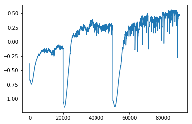
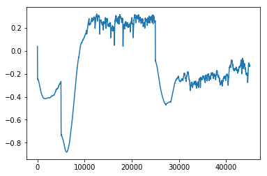

In this page we simulate data from a causal model in observational setting and examine the effect of omitted variables which stochastically predict the treatment assignment.

First import the necessary libraries:


```python
import numpy as np 
import pandas as pd 
import mlp

from sklearn.linear_model import LinearRegression, LogisticRegression
from glmnet import LogitNet, ElasticNet
import torch
import torch.nn as nn
import torch.nn.functional as F
from torch.autograd import Variable

import utils
from utils import simulate_x, nonlinear, simulate_params

from sklearn.preprocessing import StandardScaler

import matplotlib.pyplot as plt
```

Simulate 4 types of observed covariates:
X_c are a set of covariates that influence both the treatment and outcome, also called confouders.
X_iv are a set of covariates only influence treatment and not outcome, also called nstrumental variables.
X_y are a set of covariates only influence the outcome and not treatment.
X_n are a set of covariates influencing neither of treatment and outcome.

Accordingly, we define the number of covariates (dimension of columns) as p_c, p_iv, p_y, p_n

We fix the correlation between the covarites in each set to follow the same pattern with the base correlation rho. The correlation pattern is so that corr(X_j, X_k) = rho^(j-k). This is known as auto-regressive, AR(1).

We let the range of signals sizes be between r1 and r2.

We let the treatment be a binary treatment with probability of treated to be pr.


```python
n, p_c, p_iv, p_y, p_n = 20000, 100, 100, 100, 100
rho = .5
```


```python
X_c = simulate_x(n=n, p=p_c, rho=rho, mean=0., sd=1., corr="AR(1)")
X_iv = simulate_x(n=n, p=p_iv, rho=rho, mean=0., sd=1., corr="AR(1)")
X_y = simulate_x(n=n, p=p_y, rho=rho, mean=0., sd=1., corr="AR(1)")
X_n = simulate_x(n=n, p=p_n, rho=rho, mean=0., sd=1., corr="AR(1)")
```

Let's agument some nonlinear functions of the columns in each covariate matrix:

f1(x) = exp(x/2)

f2(x1, x2) = x1/(1+exp(x2))

f3(x1, x2) = (x1*x2/10+2)^3

f4(x1, x2) = (x1+x2+3)^2

f5(x1, x2) = g(x1) * h(x2)

where

g(x) = -2 * I(x < -1) - I(-1 < x < 0) + I(0 < x < 2)+ 3 * I(x > 2)

h(x) = -5 * I(x < 0) - 2 * I(0 < x < 1) + 3 * I(x > 1)

and 

f6(x1, x2) = g(x1) * h(x2)

where 

g(x) = I(x > 0)

h(x) = I(x > 1)


We let "prob" proportion of covariates in each matrix to be replaced by randomly selected nonlinearities. These nonlinearities are bivariate. We randomly select two of the covariates each time and implement the nonlinearities.


```python
X_c_latent = nonlinear(X_c, prob=.10)# prob is the proportion of columns that are replaced by nonlinear functions.
X_iv_latent = nonlinear(X_iv, prob=.10)
X_y_latent = nonlinear(X_y, prob=.10)
```

Fix the effects of the confounders, instrumental variables and irrelevant variable (those that just predict outcome but not the treatment and those that predict neither of them.)


```python
r1 = .1
r2 = 2.
r = ["uniform", r1, r2]
```

Generate the treatment given the confounders and instrumental variables:


```python
param_iv = simulate_params(p1=p_iv + p_c, r=r)
xbeta_iv = np.dot(np.hstack((X_iv_latent, X_c_latent)), param_iv)
pr = 1./(1. + np.exp(-xbeta_iv))
A = np.random.binomial(1, pr, size=(n, 1))
```

Generate the outcome given the confounders and its own predictors:


```python
param_y = simulate_params(p1=p_y + p_c, r=r)
TE = .5

xbeta_y = np.dot(np.hstack((A, np.hstack((X_y_latent, X_c_latent)))), np.vstack((TE, param_y))).reshape(-1, 1)

y = xbeta_y + np.random.normal(size=(n, 1))
```

Let's stack all types of covariates in one giant matrix and standardize the inputs. Note that these are observed covariates, not the non-linear ones.


```python
index_c = np.arange(p_c)
index_iv = np.arange(p_c, p_c + p_iv)

x_ = np.concatenate([X_c, X_iv, X_y, X_n], axis=1)# Big data with all covarites (excluding th treatment)

sdtz = StandardScaler()
x = sdtz.fit_transform(x_) # Mean 0 and unit variance 
```

Estimation of the propensity score using lasso logistic regression. 


```python
ps_m = LogitNet(alpha=1, n_splits=3)
ps_m = ps_m.fit(x, A.ravel())
ps = ps_m.predict_proba(x)[:, 0].reshape(-1, 1)
```


```python
plt.hist(ps)
plt.show()
```


Let's run regression analysis to predict the outcome by adjusting for the propensity score:


```python
model_adj_ps = LinearRegression()

model_adj_ps.fit(np.hstack((A, ps)), y)

TE_hat_adj_ps = model_adj_ps.coef_[0][0]
print(TE_hat_adj_ps)
```

    -2.718225359089778


Propensity score matching:


```python
A_ones = (A == 1).flatten()
A_zeros = (A == 0).flatten()
```


```python
np.mean((y[A_ones, :]/ps[A_ones])) - np.mean((y[A_zeros, :]/(1 - ps[A_zeros])))
```


    847.9054255240109


Here we run a linear regression with L1 penalization (similar to lasso) on the coefficients of covariates, not the treatment. 


```python
class LinearRegL1Covariates(torch.nn.Module):
    def __init__(self, p):
        super(LinearRegL1Covariates, self).__init__()

        self.linear = torch.nn.Linear(p, 1, bias=False)
        self.treatment = torch.nn.Linear(1, 1, bias=True)

    def forward(self, x, A):
        lin = self.linear(x)
        treat = self.treatment(A)
        return(lin + treat)
```

If we want to use GPU:


```python
device = torch.device("cuda:0" if torch.cuda.is_available() else "cpu")
# device = torch.device("cpu")
```

Convert the datasets to tensor:


```python
n, p = x.shape
xx = x.copy()
yy = y.copy()
x_tensor = Variable(torch.from_numpy(xx).float(), requires_grad = False).to(device)
y_tensor = Variable(torch.from_numpy(yy.reshape(-1, 1)).float(), requires_grad = False).to(device)
A_tensor = Variable(torch.from_numpy(A.reshape(-1, 1)).float(), requires_grad = False).to(device)
```

Initialize the model and set the optimization methods:


```python
# linreg_instance = LinearRegL1Covariates(p).to(device)

# loss = torch.nn.MSELoss(size_average=True)
# optimizer  = torch.optim.Adam(linreg_instance.parameters(), lr = 0.01)
```

Run the optimization for the linear regression. We L1 penalize the coefficients of the observed covariates and do not L1 penalize the intercept and the treatment effect.


```python
%%time
# training
linreg_instance = LinearRegL1Covariates(p).to(device)

loss = torch.nn.MSELoss(size_average=True)
optimizer  = torch.optim.Adam(linreg_instance.parameters(), lr = 0.05)


reg_lambda = .1
list_loss = []
list_TE = []

for epoch in range(5000):
    
    for name, param in linreg_instance.named_parameters():
        if "treatment.weight" not in name and "treatment.bias" not in name:
            l1_reg = torch.sum(torch.abs(param))

    y_pred = linreg_instance(x_tensor, A_tensor)
    l = loss(y_pred, y_tensor) + reg_lambda * l1_reg

    optimizer.zero_grad()
    l.backward()
    optimizer.step()
    
    list_loss += [l]
    for name, param in linreg_instance.named_parameters():
        if "treatment.weight" in name:
            list_TE += [param.data[0][0].to("cpu").numpy()]

for name, param in linreg_instance.named_parameters():
    if "treatment.weight" in name:
        print(name)
        print("\n")
        print("treatment effect: " + str(param.data[0][0].to("cpu").numpy()))
```

    /home/mr/.local/lib/python3.6/site-packages/torch/nn/_reduction.py:49: UserWarning: size_average and reduce args will be deprecated, please use reduction='mean' instead.
      warnings.warn(warning.format(ret))


    treatment.weight
    
    
    treatment effect: -1.3452001
    CPU times: user 4.39 s, sys: 632 ms, total: 5.03 s
    Wall time: 5.07 s


```python
plt.plot(np.array(list_TE))
plt.show()
```


Here we run neural networks with L1 penalization (similar to lasso) on the hidden layers weights. We let the treatment be estimated linearly. So the model is: E(y|A, X) = beta0 + beta1*A + E(error|X)
Noted that beta1 is not regularized.


```python

class NNLinear(torch.nn.Module):
    def __init__(self, p, hidden, skip_connection=True, activation="relu", batch_norm=True, **kwargs):
        super(NNLinear, self).__init__()
        
        if p != int(p):
            raise ValueError("p, the number of inputs should be integer.")
        
        if not isinstance(hidden, list):
            raise ValueError("hidden should be a list, containing hidden layer size(s).")
        
        self.skip_connection = skip_connection
        self.n_hidden_lyrs = len(hidden)
        self.batch_norm = batch_norm

        if activation is "relu":
            self.activation = F.relu
        elif activation is "tanh":
            self.activation = F.tanh

        if self.n_hidden_lyrs is 0:
            raise ValueError("Hidden layers cannot have zero length.")
        else:
            hidden = [p] + hidden

            if self.n_hidden_lyrs != 0:
                layers = nn.ModuleDict()
                bn = nn.ModuleDict()
                for i in range(self.n_hidden_lyrs):
                    layers[str(i)] = torch.nn.Linear(hidden[i], hidden[i + 1])
                    bn[str(i)] = torch.nn.BatchNorm1d(num_features=hidden[i + 1])
                self.layers = layers
                self.bn = bn

            if self.skip_connection:
                self.linear_out = torch.nn.Linear(hidden[self.n_hidden_lyrs] + p, 1)
            else:
                self.linear_out = torch.nn.Linear(hidden[self.n_hidden_lyrs], 1)
                
        self.kwargs = kwargs
        self.do_drop = False
        if "prob" in self.kwargs:
            prob = float(self.kwargs["prob"])
            if prob > 0.:
                self.do_drop = True
                self.drop = torch.nn.Dropout(p=prob)
            
        self.treatment = torch.nn.Linear(1, 1, bias=True)
        
    def forward(self, x, A):
        out = x

        for i in range(self.n_hidden_lyrs):
            out = self.layers[str(i)](out)
            out = self.activation(out)
            if self.batch_norm:
                out = self.bn[str(i)](out)
            
        if self.do_drop is True:
            out = self.drop(out)
            
        if self.skip_connection is True:
            out = torch.cat((out, x), 1)
        else:
            out = self.linear_out(out)
        
        if self.do_drop is True:
            out = self.drop(out)
            
        out = out + self.treatment(A)
        return(out)
    
```


```python
%%time
n, p = x.shape
hidden = [p]# numbre of hidden layres: 1

nnlinear_instance = NNLinear(p, hidden, skip_connection=False, activation="relu", batch_norm=True, prob=0.).to(device)
print(device)
# print(next(nnlinear_instance.parameters()).is_cuda)

loss = torch.nn.MSELoss(size_average=True)
optimizer  = torch.optim.Adam(nnlinear_instance.parameters(), lr = 0.01)

# training
nnlinear_instance.train()
reg_lambda = .1

old_loss = 0.
j = 0
list_loss = []
list_TE = []

for epoch in range(20000):
    l1_reg = 0. 
    for name, param in nnlinear_instance.named_parameters():
        if "treatment.weight" not in name and "treatment.bias" not in name:
            l1_reg += torch.sum(torch.abs(param))

    y_pred = nnlinear_instance(x_tensor, A_tensor)

    l = loss(y_pred, y_tensor) + reg_lambda * l1_reg

    optimizer.zero_grad()
    l.backward()
    optimizer.step()
    list_loss += [l]
    for name, param in nnlinear_instance.named_parameters():
        if "treatment.weight" in name:
            list_TE += [param.data[0][0].to("cpu").numpy()]
    
for name, param in nnlinear_instance.named_parameters():
    if "treatment.weight" in name:
        print("treatment effect: " + str(param.data[0][0].to("cpu").numpy()))
```

    cuda:0


    /home/mr/.local/lib/python3.6/site-packages/torch/nn/_reduction.py:49: UserWarning: size_average and reduce args will be deprecated, please use reduction='mean' instead.
      warnings.warn(warning.format(ret))


    treatment effect: -0.14740932
    CPU times: user 1min 53s, sys: 40.6 s, total: 2min 34s
    Wall time: 2min 34s


```python
plt.plot(np.array(list_TE))
plt.show()
```


```python
%%time
n, p = x.shape
hidden = [p, p]# numbre of hidden layres: 2

nnlinear_instance = NNLinear(p, hidden, skip_connection=False, activation="relu", batch_norm=True, prob=0.).to(device)
print(device)
# print(next(nnlinear_instance.parameters()).is_cuda)

loss = torch.nn.MSELoss(size_average=True)
optimizer  = torch.optim.Adam(nnlinear_instance.parameters(), lr = 0.01)

# training
nnlinear_instance.train()
reg_lambda = .1

old_loss = 0.
j = 0
list_loss = []

for epoch in range(40000):
    l1_reg = 0. 
    for name, param in nnlinear_instance.named_parameters():
        if "treatment.weight" not in name and "treatment.bias" not in name:
            l1_reg += torch.sum(torch.abs(param))

    y_pred = nnlinear_instance(x_tensor, A_tensor)

    l = loss(y_pred, y_tensor) + reg_lambda * l1_reg

    optimizer.zero_grad()
    l.backward()
    optimizer.step()
    list_loss += [l]
    for name, param in nnlinear_instance.named_parameters():
        if "treatment.weight" in name:
            list_TE += [param.data[0][0].to("cpu").numpy()]
    
for name, param in nnlinear_instance.named_parameters():
    if "treatment.weight" in name:
        print("treatment effect: " + str(param.data[0][0]))
```

    cuda:0


    /home/mr/.local/lib/python3.6/site-packages/torch/nn/_reduction.py:49: UserWarning: size_average and reduce args will be deprecated, please use reduction='mean' instead.
      warnings.warn(warning.format(ret))


    treatment effect: tensor(0.1887, device='cuda:0')
    CPU times: user 2min 32s, sys: 58.2 s, total: 3min 31s
    Wall time: 3min 31s


```python
plt.plot(np.array(list_TE))
plt.show()
```


```python
%%time
n, p = x.shape
hidden = [p, p, p]# numbre of hidden layres: 3

nnlinear_instance = NNLinear(p, hidden, skip_connection=False, activation="relu", batch_norm=True, prob=0.).to(device)
print(device)
# print(next(nnlinear_instance.parameters()).is_cuda)

loss = torch.nn.MSELoss(size_average=True)
optimizer  = torch.optim.Adam(nnlinear_instance.parameters(), lr = 0.01)

# training
nnlinear_instance.train()
reg_lambda = .1

old_loss = 0.
j = 0
list_loss = []
for epoch in range(40000):
    l1_reg = 0. 
    for name, param in nnlinear_instance.named_parameters():
        if "treatment.weight" not in name and "treatment.bias" not in name:
            l1_reg += torch.sum(torch.abs(param))

    y_pred = nnlinear_instance(x_tensor, A_tensor)

    l = loss(y_pred, y_tensor) + reg_lambda * l1_reg

    optimizer.zero_grad()
    l.backward()
    optimizer.step()
    list_loss += [l]
    for name, param in nnlinear_instance.named_parameters():
        if "treatment.weight" in name:
            list_TE += [param.data[0][0].to("cpu").numpy()]
    
for name, param in nnlinear_instance.named_parameters():
    if "treatment.weight" in name:
        print("treatment effect: " + str(param.data[0][0]))
```

    cuda:0


    /home/mr/.local/lib/python3.6/site-packages/torch/nn/_reduction.py:49: UserWarning: size_average and reduce args will be deprecated, please use reduction='mean' instead.
      warnings.warn(warning.format(ret))


    treatment effect: tensor(0.4661, device='cuda:0')
    CPU times: user 15min 36s, sys: 6min 3s, total: 21min 40s
    Wall time: 21min 41s


```python
plt.plot(np.array(list_TE))
plt.show()
```





```python
%%time
n, p = x.shape
hidden = [p, p, p, p]# numbre of hidden layres: 4

nnlinear_instance = NNLinear(p, hidden, skip_connection=False, activation="relu", batch_norm=True, prob=0.).to(device)
print(device)
# print(next(nnlinear_instance.parameters()).is_cuda)

loss = torch.nn.MSELoss(size_average=True)
optimizer  = torch.optim.Adam(nnlinear_instance.parameters(), lr = 0.01)

# training
nnlinear_instance.train()
reg_lambda = .1

old_loss = 0.
j = 0
list_loss = []

for epoch in range(20000):
    l1_reg = 0. 
    for name, param in nnlinear_instance.named_parameters():
        if "treatment.weight" not in name and "treatment.bias" not in name:
            l1_reg += torch.sum(torch.abs(param))

    y_pred = nnlinear_instance(x_tensor, A_tensor)

    l = loss(y_pred, y_tensor) + reg_lambda * l1_reg

    optimizer.zero_grad()
    l.backward()
    optimizer.step()
    list_loss += [l]
    for name, param in nnlinear_instance.named_parameters():
        if "treatment.weight" in name:
            list_TE += [param.data[0][0].to("cpu").numpy()]
    
for name, param in nnlinear_instance.named_parameters():
    if "treatment.weight" in name:
        print("treatment effect: " + str(param.data[0][0]))
```

    cuda:0


    /home/mr/.local/lib/python3.6/site-packages/torch/nn/_reduction.py:49: UserWarning: size_average and reduce args will be deprecated, please use reduction='mean' instead.
      warnings.warn(warning.format(ret))


    treatment effect: tensor(0.2104, device='cuda:0')
    CPU times: user 10min 38s, sys: 4min 7s, total: 14min 46s
    Wall time: 14min 47s


```python
plt.plot(np.array(list_TE))
plt.show()
```


```python
%%time
n, p = x.shape
hidden = [p, p, p, p, p]# numbre of hidden layres: 5

nnlinear_instance = NNLinear(p, hidden, skip_connection=False, activation="relu", batch_norm=True, prob=0.).to(device)
print(device)
# print(next(nnlinear_instance.parameters()).is_cuda)

loss = torch.nn.MSELoss(size_average=True)
optimizer  = torch.optim.Adam(nnlinear_instance.parameters(), lr = 0.01)

# training
nnlinear_instance.train()
reg_lambda = .1

old_loss = 0.
j = 0
list_loss = []
for epoch in range(20000):
    l1_reg = 0. 
    for name, param in nnlinear_instance.named_parameters():
        if "treatment.weight" not in name and "treatment.bias" not in name:
            l1_reg += torch.sum(torch.abs(param))

    y_pred = nnlinear_instance(x_tensor, A_tensor)

    l = loss(y_pred, y_tensor) + reg_lambda * l1_reg

    optimizer.zero_grad()
    l.backward()
    optimizer.step()
    list_loss += [l]
    for name, param in nnlinear_instance.named_parameters():
        if "treatment.weight" in name:
            list_TE += [param.data[0][0].to("cpu").numpy()]
    
for name, param in nnlinear_instance.named_parameters():
    if "treatment.weight" in name:
        print("treatment effect: " + str(param.data[0][0]).to("cpu").numpy())
```

    cuda:0


    /home/mr/.local/lib/python3.6/site-packages/torch/nn/_reduction.py:49: UserWarning: size_average and reduce args will be deprecated, please use reduction='mean' instead.
      warnings.warn(warning.format(ret))


    treatment effect: tensor(0.5523, device='cuda:0')
    CPU times: user 13min 17s, sys: 5min 10s, total: 18min 27s
    Wall time: 18min 28s


```python
plt.plot(np.array(list_TE))
plt.show()
```


```python
%%time
n, p = x.shape
hidden = [p, p, p, p, p, p]# numbre of hidden layres: 6

nnlinear_instance = NNLinear(p, hidden, skip_connection=False, activation="relu", batch_norm=True, prob=0.).to(device)
print(device)
# print(next(nnlinear_instance.parameters()).is_cuda)

loss = torch.nn.MSELoss(size_average=True)
optimizer  = torch.optim.Adam(nnlinear_instance.parameters(), lr = 0.01)

# training
nnlinear_instance.train()
reg_lambda = .1

old_loss = 0.
j = 0
list_loss = []
for epoch in range(20000):
    l1_reg = 0. 
    for name, param in nnlinear_instance.named_parameters():
        if "treatment.weight" not in name and "treatment.bias" not in name:
            l1_reg += torch.sum(torch.abs(param))

    y_pred = nnlinear_instance(x_tensor, A_tensor)

    l = loss(y_pred, y_tensor) + reg_lambda * l1_reg

    optimizer.zero_grad()
    l.backward()
    optimizer.step()
    list_loss += [l]
    for name, param in nnlinear_instance.named_parameters():
        if "treatment.weight" in name:
            list_TE += [param.data[0][0].to("cpu").numpy()]
    
for name, param in nnlinear_instance.named_parameters():
    if "treatment.weight" in name:
        print("treatment effect: " + str(param.data[0][0].to("cpu").numpy()))
```

    treatment effect: 0.5319707


```python
plt.plot(np.array(list_TE))
plt.show()
```


```python
%%time
n, p = x.shape
hidden = [p, p, p, p, p, p, p]# numbre of hidden layres: 7

nnlinear_instance = NNLinear(p, hidden, skip_connection=False, activation="relu", batch_norm=True, prob=0.).to(device)
print(device)
# print(next(nnlinear_instance.parameters()).is_cuda)

loss = torch.nn.MSELoss(size_average=True)
optimizer  = torch.optim.Adam(nnlinear_instance.parameters(), lr = 0.01)

# training
nnlinear_instance.train()
reg_lambda = .1

old_loss = 0.
j = 0
list_loss = []
for epoch in range(20000):
    l1_reg = 0. 
    for name, param in nnlinear_instance.named_parameters():
        if "treatment.weight" not in name and "treatment.bias" not in name:
            l1_reg += torch.sum(torch.abs(param))

    y_pred = nnlinear_instance(x_tensor, A_tensor)

    l = loss(y_pred, y_tensor) + reg_lambda * l1_reg

    optimizer.zero_grad()
    l.backward()
    optimizer.step()
    list_loss += [l]
    for name, param in nnlinear_instance.named_parameters():
        if "treatment.weight" in name:
            list_TE += [param.data[0][0].to("cpu").numpy()]
    
for name, param in nnlinear_instance.named_parameters():
    if "treatment.weight" in name:
        print("treatment effect: " + str(param.data[0][0].to("cpu").numpy()))
```

    cuda:0


    /home/mr/.local/lib/python3.6/site-packages/torch/nn/_reduction.py:49: UserWarning: size_average and reduce args will be deprecated, please use reduction='mean' instead.
      warnings.warn(warning.format(ret))


    treatment effect: 0.514087
    CPU times: user 18min 18s, sys: 7min 15s, total: 25min 33s
    Wall time: 25min 34s


```python
plt.plot(np.array(list_TE))
plt.show()
```


```python
%%time
n, p = x.shape
hidden = [p, p, p, p, p, p, p, p]# numbre of hidden layres: 8

nnlinear_instance = NNLinear(p, hidden, skip_connection=False, activation="relu", batch_norm=True, prob=0.).to(device)
print(device)
# print(next(nnlinear_instance.parameters()).is_cuda)

loss = torch.nn.MSELoss(size_average=True)
optimizer  = torch.optim.Adam(nnlinear_instance.parameters(), lr = 0.01)

# training
nnlinear_instance.train()
reg_lambda = .1

old_loss = 0.
j = 0
list_loss = []
for epoch in range(20000):
    l1_reg = 0. 
    for name, param in nnlinear_instance.named_parameters():
        if "treatment.weight" not in name and "treatment.bias" not in name:
            l1_reg += torch.sum(torch.abs(param))

    y_pred = nnlinear_instance(x_tensor, A_tensor)

    l = loss(y_pred, y_tensor) + reg_lambda * l1_reg

    optimizer.zero_grad()
    l.backward()
    optimizer.step()
    list_loss += [l]
    for name, param in nnlinear_instance.named_parameters():
        if "treatment.weight" in name:
            list_TE += [param.data[0][0].to("cpu").numpy()]
    
for name, param in nnlinear_instance.named_parameters():
    if "treatment.weight" in name:
        print("treatment effect: " + str(param.data[0][0].to("cpu").numpy()))
```


```python
plt.plot(np.array(list_TE))
plt.show()
```


Full interaction model (all observed covariates) have 2-way interactions. L1 regularization is applied on the parameters of interaction terms. We can also include the linear terms for the covariates too. L1 regularization should be applied on all of them:


```python
class interacted_nn(torch.nn.Module):
    def __init__(self, p, hidden, skip_connection=True, activation="relu"):
        super(interacted_nn, self).__init__()

        self.skip_connection = skip_connection
        self.n_hidden_lyrs = len(hidden)

        if activation is "relu":
            self.activation = F.relu
        elif activation is "tanh":
            self.activation = F.tanh

        if self.n_hidden_lyrs is 0:
            raise ValueError("Hidden layers cannot have zero length.")
        else:
            hidden = [p] + hidden

            if self.n_hidden_lyrs is not 0:
                layers = nn.ModuleDict()
                for i in range(self.n_hidden_lyrs):
                    layers[str(i)] = torch.nn.Linear(hidden[i], hidden[i + 1])
                self.layers = layers

            if self.skip_connection:
                self.linear_out = torch.nn.Linear(hidden[self.n_hidden_lyrs] + p, 1, bias=False)
            else:
                self.linear_out = torch.nn.Linear(hidden[self.n_hidden_lyrs], 1, bias=False)
            
            self.treatment = torch.nn.Linear(1, 1, bias=True)

    def forward(self, x, A):
        out = x

        for i in range(self.n_hidden_lyrs):
            previous_out = out
            out = self.layers[str(i)](out)
            out = previous_out * out
            if self.activation is not "identity":
                out = self.activation(out)
                
        if self.skip_connection is True:
            out = torch.cat((out, x), 1)
        
        out = self.linear_out(out) + self.treatment(A)
        return(out)

```


```python
%%time
n, p = x.shape
hidden = [p]

nn_nteraction_instance = interacted_nn(p=p, hidden=hidden, skip_connection=False, activation="relu").to(device)

loss = torch.nn.MSELoss(size_average=True)
optimizer  = torch.optim.Adam(nn_nteraction_instance.parameters(), lr = 0.01)

# training
nn_nteraction_instance.train()
reg_lambda = .1
list_loss = []
list_TE_intraction = []

for epoch in range(15000):
    l1_reg = 0.
    for name, param in nn_nteraction_instance.named_parameters():
        if "treatment.weight" not in name and "treatment.bias" not in name:
            l1_reg += torch.sum(torch.abs(param))

    y_pred = nn_nteraction_instance(x_tensor, A_tensor)

    l = loss(y_pred, y_tensor) + reg_lambda * l1_reg

    optimizer.zero_grad()
    l.backward()
    optimizer.step()
    list_loss += [l]
    for name, param in nn_nteraction_instance.named_parameters():
        if "treatment.weight" in name:
            list_TE_intraction += [param.data[0][0].to("cpu").numpy()]


for name, param in nn_nteraction_instance.named_parameters():
    if "treatment.weight" in name:
        print(name)
        print("treatment effect: " + str(param.data[0][0].to("cpu").numpy()))
        print("\n")

```

    /home/mr/.local/lib/python3.6/site-packages/torch/nn/_reduction.py:49: UserWarning: size_average and reduce args will be deprecated, please use reduction='mean' instead.
      warnings.warn(warning.format(ret))


    treatment.weight
    
    
    treatment effect: -0.7217358
    CPU times: user 1min 12s, sys: 25.2 s, total: 1min 37s
    Wall time: 1min 38s


```python
plt.plot(np.array(list_TE_intraction))
plt.show()
```


To filter The instrumental variables, maybe it's good to incorporate the treatment in the output layer:


```python

class BNN(torch.nn.Module):
    def __init__(self, p, hidden, skip_connection=True, activation="relu", batch_norm=False, **kwargs):
        super(BNN, self).__init__()
        
        if p != int(p):
            raise ValueError("p, the number of inputs should be integer.")
        
        if not isinstance(hidden, list):
            raise ValueError("hidden should be a list, containing hidden layer size(s).")
        
        self.skip_connection = skip_connection
        self.n_hidden_lyrs = len(hidden)
        self.batch_norm = batch_norm

        if activation is "relu":
            self.activation = F.relu
        elif activation is "tanh":
            self.activation = F.tanh

        if self.n_hidden_lyrs is 0:
            raise ValueError("Hidden layers cannot have zero length.")
        else:
            hidden = [p] + hidden

            if self.n_hidden_lyrs != 0:
                layers = nn.ModuleDict()
                bn = nn.ModuleDict()
                for i in range(self.n_hidden_lyrs):
                    layers[str(i)] = torch.nn.Linear(hidden[i], hidden[i + 1])
                    bn[str(i)] = torch.nn.BatchNorm1d(num_features=hidden[i + 1])
                self.layers = layers
                self.bn = bn

            if self.skip_connection:
                self.linear_out_y = torch.nn.Linear(hidden[self.n_hidden_lyrs] + p, 1)
                self.linear_out_A = torch.nn.Linear(hidden[self.n_hidden_lyrs] + p, 1)
            else:
                self.linear_out_y = torch.nn.Linear(hidden[self.n_hidden_lyrs], 1)
                self.linear_out_A = torch.nn.Linear(hidden[self.n_hidden_lyrs], 1)
                
        self.kwargs = kwargs
        self.do_drop = False
        if "prob" in self.kwargs:
            prob = float(self.kwargs["prob"])
            if prob > 0.:
                self.do_drop = True
                self.drop = torch.nn.Dropout(p=prob)
        
        self.treatment = torch.nn.Linear(1, 1, bias=True)
        
    def forward(self, x, A):
        out = x

        for i in range(self.n_hidden_lyrs):
            out = self.layers[str(i)](out)
            out = self.activation(out)
            if self.batch_norm:
                out = self.bn[str(i)](out)
            
        if self.do_drop is True:
            out = self.drop(out)
            
        if self.skip_connection is True:
            out = torch.cat((out, x), 1)
        
        out_y = self.linear_out_y(out)
        out_A = F.sigmoid(self.linear_out_A(out))
        if self.do_drop is True:
            out_y = self.drop(out_y)
            out_A = self.drop(out_A)
        
        out_y = out_y + self.treatment(A)
        return(out_y, out_A)
    
```


```python
%%time
n, p = x.shape
hidden = [p]# numbre of hidden layres: 1

bnn_instance = BNN(p, hidden, skip_connection=False, activation="relu", batch_norm=True).to(device)

loss_y = torch.nn.MSELoss(size_average=True)
loss_A = torch.nn.BCELoss()
optimizer  = torch.optim.Adam(bnn_instance.parameters(), lr = 0.01)

# training
bnn_instance.train()
reg_lambda = .1
list_loss = []
list_TE_bnn = []

for epoch in range(5000):
    l1_reg = 0.
    for name, param in bnn_instance.named_parameters():
        if "treatment.weight" not in name and "treatment.bias" not in name:
            l1_reg += torch.sum(torch.abs(param))

    y_pred, A_pred = bnn_instance(x_tensor, A_tensor)

    l = loss_y(y_pred, y_tensor) + loss_A(A_pred, A_tensor) + reg_lambda * l1_reg

    optimizer.zero_grad()
    l.backward()
    optimizer.step()
    list_loss += [l]
    for name, param in bnn_instance.named_parameters():
        if "treatment.weight" in name:
            list_TE_bnn += [param.data[0][0].to("cpu").numpy()]

for name, param in bnn_instance.named_parameters():
    if "treatment.weight" in name:
        print(name)
        print("treatment effect: " + str(param.data[0][0].to("cpu").numpy()))
        print("\n")

```

    /home/mr/.local/lib/python3.6/site-packages/torch/nn/_reduction.py:49: UserWarning: size_average and reduce args will be deprecated, please use reduction='mean' instead.
      warnings.warn(warning.format(ret))
    /home/mr/.local/lib/python3.6/site-packages/torch/nn/functional.py:1332: UserWarning: nn.functional.sigmoid is deprecated. Use torch.sigmoid instead.
      warnings.warn("nn.functional.sigmoid is deprecated. Use torch.sigmoid instead.")


    treatment.weight
    treatment effect: -0.26772243
    
    
    CPU times: user 47.5 s, sys: 16 s, total: 1min 3s
    Wall time: 1min 3s


```python
plt.plot(np.array(list_TE_bnn))
plt.show()
```


```python
%%time
n, p = x.shape
hidden = [p, p]# numbre of hidden layres: 2

bnn_instance = BNN(p, hidden, skip_connection=False, activation="relu", batch_norm=True).to(device)

loss_y = torch.nn.MSELoss(size_average=True)
loss_A = torch.nn.BCELoss()
optimizer  = torch.optim.Adam(bnn_instance.parameters(), lr = 0.01)

# training
bnn_instance.train()
reg_lambda = .1
list_loss = []

for epoch in range(20000):
    l1_reg = 0.
    for name, param in bnn_instance.named_parameters():
        if "treatment.weight" not in name and "treatment.bias" not in name:
            l1_reg += torch.sum(torch.abs(param))

    y_pred, A_pred = bnn_instance(x_tensor, A_tensor)

    l = loss_y(y_pred, y_tensor) + loss_A(A_pred, A_tensor) + reg_lambda * l1_reg

    optimizer.zero_grad()
    l.backward()
    optimizer.step()
    list_loss += [l]
    for name, param in bnn_instance.named_parameters():
        if "treatment.weight" in name:
            list_TE_bnn += [param.data[0][0].to("cpu").numpy()]

for name, param in bnn_instance.named_parameters():
    if "treatment.weight" in name:
        print(name)
        print("treatment effect: " + str(param.data[0][0].to("cpu").numpy()))
        print("\n")

```

    /home/mr/.local/lib/python3.6/site-packages/torch/nn/_reduction.py:49: UserWarning: size_average and reduce args will be deprecated, please use reduction='mean' instead.
      warnings.warn(warning.format(ret))
    /home/mr/.local/lib/python3.6/site-packages/torch/nn/functional.py:1332: UserWarning: nn.functional.sigmoid is deprecated. Use torch.sigmoid instead.
      warnings.warn("nn.functional.sigmoid is deprecated. Use torch.sigmoid instead.")


    treatment.weight
    treatment effect: 0.25659743
    
    
    CPU times: user 5min 41s, sys: 2min 6s, total: 7min 47s
    Wall time: 7min 48s


```python
plt.plot(np.array(list_TE_bnn))
plt.show()
```


```python
%%time
n, p = x.shape
hidden = [p, p, p]# numbre of hidden layres: 3

bnn_instance = BNN(p, hidden, skip_connection=False, activation="relu", batch_norm=True).to(device)

loss_y = torch.nn.MSELoss(size_average=True)
loss_A = torch.nn.BCELoss()
optimizer  = torch.optim.Adam(bnn_instance.parameters(), lr = 0.01)

# training
bnn_instance.train()
reg_lambda = .1
list_loss = []

for epoch in range(20000):
    l1_reg = 0.
    for name, param in bnn_instance.named_parameters():
        if "treatment.weight" not in name and "treatment.bias" not in name:
            l1_reg += torch.sum(torch.abs(param))

    y_pred, A_pred = bnn_instance(x_tensor, A_tensor)

    l = loss_y(y_pred, y_tensor) + loss_A(A_pred, A_tensor) + reg_lambda * l1_reg

    optimizer.zero_grad()
    l.backward()
    optimizer.step()
    list_loss += [l]
    for name, param in bnn_instance.named_parameters():
        if "treatment.weight" in name:
            list_TE_bnn += [param.data[0][0].to("cpu").numpy()]

for name, param in bnn_instance.named_parameters():
    if "treatment.weight" in name:
        print(name)
        print("treatment effect: " + str(param.data[0][0].to("cpu").numpy()))
        print("\n")

```

    /home/mr/.local/lib/python3.6/site-packages/torch/nn/_reduction.py:49: UserWarning: size_average and reduce args will be deprecated, please use reduction='mean' instead.
      warnings.warn(warning.format(ret))
    /home/mr/.local/lib/python3.6/site-packages/torch/nn/functional.py:1332: UserWarning: nn.functional.sigmoid is deprecated. Use torch.sigmoid instead.
      warnings.warn("nn.functional.sigmoid is deprecated. Use torch.sigmoid instead.")


    treatment.weight
    treatment effect: -0.13428146
    
    
    CPU times: user 8min 14s, sys: 3min 8s, total: 11min 23s
    Wall time: 11min 23s


```python
plt.plot(np.array(list_TE_bnn))
plt.show()
```


```python
%%time
n, p = x.shape
hidden = [p, p, p, p]# numbre of hidden layres: 4

bnn_instance = BNN(p, hidden, skip_connection=False, activation="relu", batch_norm=True).to(device)

loss_y = torch.nn.MSELoss(size_average=True)
loss_A = torch.nn.BCELoss()
optimizer  = torch.optim.Adam(bnn_instance.parameters(), lr = 0.01)

# training
bnn_instance.train()
reg_lambda = .1
list_loss = []

for epoch in range(20000):
    l1_reg = 0.
    for name, param in bnn_instance.named_parameters():
        if "treatment.weight" not in name and "treatment.bias" not in name:
            l1_reg += torch.sum(torch.abs(param))

    y_pred, A_pred = bnn_instance(x_tensor, A_tensor)

    l = loss_y(y_pred, y_tensor) + loss_A(A_pred, A_tensor) + reg_lambda * l1_reg

    optimizer.zero_grad()
    l.backward()
    optimizer.step()
    list_loss += [l]
    for name, param in bnn_instance.named_parameters():
        if "treatment.weight" in name:
            list_TE_bnn += [param.data[0][0].to("cpu").numpy()]

for name, param in bnn_instance.named_parameters():
    if "treatment.weight" in name:
        print(name)
        print("treatment effect: " + str(param.data[0][0].to("cpu").numpy()))
        print("\n")

```

    /home/mr/.local/lib/python3.6/site-packages/torch/nn/_reduction.py:49: UserWarning: size_average and reduce args will be deprecated, please use reduction='mean' instead.
      warnings.warn(warning.format(ret))
    /home/mr/.local/lib/python3.6/site-packages/torch/nn/functional.py:1332: UserWarning: nn.functional.sigmoid is deprecated. Use torch.sigmoid instead.
      warnings.warn("nn.functional.sigmoid is deprecated. Use torch.sigmoid instead.")


    treatment.weight
    treatment effect: 0.31960052
    
    
    CPU times: user 11min, sys: 4min 15s, total: 15min 16s
    Wall time: 15min 16s


```python
plt.plot(np.array(list_TE_bnn))
plt.show()
```


```python
list_TE_bnn[64000:]
```


    [array(0.49928245, dtype=float32),
     array(0.49923348, dtype=float32),
     array(0.49888378, dtype=float32),
     array(0.4998847, dtype=float32),
     array(0.500427, dtype=float32),
     array(0.50044143, dtype=float32),
     array(0.5011533, dtype=float32),
     array(0.5009997, dtype=float32),
     array(0.5010323, dtype=float32),
     array(0.5021144, dtype=float32),
     array(0.50229865, dtype=float32),
     array(0.50287974, dtype=float32),
     array(0.50377715, dtype=float32),
     array(0.5045497, dtype=float32),
     array(0.50498754, dtype=float32),
     array(0.5057555, dtype=float32),
     array(0.50666606, dtype=float32),
     array(0.5068176, dtype=float32),
     array(0.50811505, dtype=float32),
     array(0.50863177, dtype=float32),
     array(0.5099631, dtype=float32),
     array(0.5099026, dtype=float32),
     array(0.5116456, dtype=float32),
     array(0.51141137, dtype=float32),
     array(0.51248866, dtype=float32),
     array(0.5117563, dtype=float32),
     array(0.5129518, dtype=float32),
     array(0.51214075, dtype=float32),
     array(0.5124601, dtype=float32),
     array(0.5127774, dtype=float32),
     array(0.5126607, dtype=float32),
     array(0.51447046, dtype=float32),
     array(0.51437014, dtype=float32),
     array(0.5136579, dtype=float32),
     array(0.51454175, dtype=float32),
     array(0.5137384, dtype=float32),
     array(0.5143107, dtype=float32),
     array(0.51477057, dtype=float32),
     array(0.51573807, dtype=float32),
     array(0.51604253, dtype=float32),
     array(0.5165633, dtype=float32),
     array(0.51740646, dtype=float32),
     array(0.5178264, dtype=float32),
     array(0.5176901, dtype=float32),
     array(0.51818705, dtype=float32),
     array(0.5170333, dtype=float32),
     array(0.51706403, dtype=float32),
     array(0.51657563, dtype=float32),
     array(0.516777, dtype=float32),
     array(0.51495945, dtype=float32),
     array(0.514451, dtype=float32),
     array(0.5128208, dtype=float32),
     array(0.5114561, dtype=float32),
     array(0.5107829, dtype=float32),
     array(0.5093086, dtype=float32),
     array(0.50865424, dtype=float32),
     array(0.5073783, dtype=float32),
     array(0.5067771, dtype=float32),
     array(0.50539535, dtype=float32),
     array(0.5055301, dtype=float32),
     array(0.5047933, dtype=float32),
     array(0.50401485, dtype=float32),
     array(0.5041968, dtype=float32),
     array(0.5036674, dtype=float32),
     array(0.50381225, dtype=float32),
     array(0.5028414, dtype=float32),
     array(0.5026893, dtype=float32),
     array(0.5024812, dtype=float32),
     array(0.50171363, dtype=float32),
     array(0.50222254, dtype=float32),
     array(0.50183034, dtype=float32),
     array(0.5014474, dtype=float32),
     array(0.50226283, dtype=float32),
     array(0.50210637, dtype=float32),
     array(0.5026097, dtype=float32),
     array(0.5018829, dtype=float32),
     array(0.5021899, dtype=float32),
     array(0.50189245, dtype=float32),
     array(0.5013399, dtype=float32),
     array(0.501915, dtype=float32),
     array(0.50082034, dtype=float32),
     array(0.501319, dtype=float32),
     array(0.500783, dtype=float32),
     array(0.50141007, dtype=float32),
     array(0.5011382, dtype=float32),
     array(0.5002576, dtype=float32),
     array(0.50029534, dtype=float32),
     array(0.5004856, dtype=float32),
     array(0.49972078, dtype=float32),
     array(0.5001189, dtype=float32),
     array(0.49894068, dtype=float32),
     array(0.49894089, dtype=float32),
     array(0.49733996, dtype=float32),
     array(0.49735704, dtype=float32),
     array(0.49615508, dtype=float32),
     array(0.49508676, dtype=float32),
     array(0.49556836, dtype=float32),
     array(0.49466464, dtype=float32),
     array(0.4952237, dtype=float32),
     array(0.49466673, dtype=float32),
     array(0.49436623, dtype=float32),
     array(0.49453995, dtype=float32),
     array(0.49379668, dtype=float32),
     array(0.49485534, dtype=float32),
     array(0.49494243, dtype=float32),
     array(0.49507168, dtype=float32),
     array(0.49498615, dtype=float32),
     array(0.49508902, dtype=float32),
     array(0.49553004, dtype=float32),
     array(0.4956891, dtype=float32),
     array(0.49616534, dtype=float32),
     array(0.49671188, dtype=float32),
     array(0.49680093, dtype=float32),
     array(0.49816617, dtype=float32),
     array(0.49756414, dtype=float32),
     array(0.497669, dtype=float32),
     array(0.49787387, dtype=float32),
     array(0.49623683, dtype=float32),
     array(0.49722797, dtype=float32),
     array(0.4958162, dtype=float32),
     array(0.49514836, dtype=float32),
     array(0.49473977, dtype=float32),
     array(0.49381697, dtype=float32),
     array(0.49397612, dtype=float32),
     array(0.4936456, dtype=float32),
     array(0.49404854, dtype=float32),
     array(0.49404395, dtype=float32),
     array(0.49441385, dtype=float32),
     array(0.4945223, dtype=float32),
     array(0.4949035, dtype=float32),
     array(0.49568784, dtype=float32),
     array(0.49598163, dtype=float32),
     array(0.49681273, dtype=float32),
     array(0.4976625, dtype=float32),
     array(0.49840614, dtype=float32),
     array(0.5000636, dtype=float32),
     array(0.50054246, dtype=float32),
     array(0.50180393, dtype=float32),
     array(0.5022386, dtype=float32),
     array(0.50219345, dtype=float32),
     array(0.50281054, dtype=float32),
     array(0.5025284, dtype=float32),
     array(0.503549, dtype=float32),
     array(0.50187635, dtype=float32),
     array(0.50321233, dtype=float32),
     array(0.50162953, dtype=float32),
     array(0.5023614, dtype=float32),
     array(0.5019179, dtype=float32),
     array(0.5013566, dtype=float32),
     array(0.50196356, dtype=float32),
     array(0.5018197, dtype=float32),
     array(0.501627, dtype=float32),
     array(0.5027709, dtype=float32),
     array(0.50250727, dtype=float32),
     array(0.50281024, dtype=float32),
     array(0.50393915, dtype=float32),
     array(0.503476, dtype=float32),
     array(0.5055353, dtype=float32),
     array(0.504484, dtype=float32),
     array(0.50612944, dtype=float32),
     array(0.5053794, dtype=float32),
     array(0.50515085, dtype=float32),
     array(0.5062439, dtype=float32),
     array(0.5061042, dtype=float32),
     array(0.5053502, dtype=float32),
     array(0.50565404, dtype=float32),
     array(0.5053626, dtype=float32),
     array(0.5046002, dtype=float32),
     array(0.50470275, dtype=float32),
     array(0.5062179, dtype=float32),
     array(0.5055903, dtype=float32),
     array(0.5048758, dtype=float32),
     array(0.5055245, dtype=float32),
     array(0.5058835, dtype=float32),
     array(0.5063431, dtype=float32),
     array(0.50560963, dtype=float32),
     array(0.5062541, dtype=float32),
     array(0.5057849, dtype=float32),
     array(0.50556904, dtype=float32),
     array(0.50615054, dtype=float32),
     array(0.50645864, dtype=float32),
     array(0.50694615, dtype=float32),
     array(0.5065096, dtype=float32),
     array(0.5068954, dtype=float32),
     array(0.5071378, dtype=float32),
     array(0.5063612, dtype=float32),
     array(0.5066613, dtype=float32),
     array(0.5065971, dtype=float32),
     array(0.50558555, dtype=float32),
     array(0.5060116, dtype=float32),
     array(0.506228, dtype=float32),
     array(0.50598985, dtype=float32),
     array(0.5060771, dtype=float32),
     array(0.5053208, dtype=float32),
     array(0.50541943, dtype=float32),
     array(0.5052539, dtype=float32),
     array(0.5060896, dtype=float32),
     array(0.50509506, dtype=float32),
     array(0.5069685, dtype=float32),
     array(0.5059146, dtype=float32),
     array(0.50649947, dtype=float32),
     array(0.5070589, dtype=float32),
     array(0.5072778, dtype=float32),
     array(0.5087152, dtype=float32),
     array(0.5082551, dtype=float32),
     array(0.50983006, dtype=float32),
     array(0.51025707, dtype=float32),
     array(0.50967026, dtype=float32),
     array(0.50974965, dtype=float32),
     array(0.5090507, dtype=float32),
     array(0.5093645, dtype=float32),
     array(0.5077077, dtype=float32),
     array(0.5067155, dtype=float32),
     array(0.5068137, dtype=float32),
     array(0.5059035, dtype=float32),
     array(0.5052687, dtype=float32),
     array(0.5037179, dtype=float32),
     array(0.502332, dtype=float32),
     array(0.5003933, dtype=float32),
     array(0.49859715, dtype=float32),
     array(0.4984087, dtype=float32),
     array(0.4970189, dtype=float32),
     array(0.49469587, dtype=float32),
     array(0.49279428, dtype=float32),
     array(0.49040812, dtype=float32),
     array(0.49022594, dtype=float32),
     array(0.48878264, dtype=float32),
     array(0.48714826, dtype=float32),
     array(0.48523238, dtype=float32),
     array(0.48517767, dtype=float32),
     array(0.48199037, dtype=float32),
     array(0.47915107, dtype=float32),
     array(0.47929388, dtype=float32),
     array(0.4757318, dtype=float32),
     array(0.4713798, dtype=float32),
     array(0.46633857, dtype=float32),
     array(0.4626774, dtype=float32),
     array(0.46151352, dtype=float32),
     array(0.45673558, dtype=float32),
     array(0.451095, dtype=float32),
     array(0.44714525, dtype=float32),
     array(0.44134885, dtype=float32),
     array(0.43561035, dtype=float32),
     array(0.4298177, dtype=float32),
     array(0.4233977, dtype=float32),
     array(0.41944924, dtype=float32),
     array(0.41475505, dtype=float32),
     array(0.4076344, dtype=float32),
     array(0.4002034, dtype=float32),
     array(0.3940883, dtype=float32),
     array(0.3893728, dtype=float32),
     array(0.38538834, dtype=float32),
     array(0.38044676, dtype=float32),
     array(0.37613675, dtype=float32),
     array(0.37400892, dtype=float32),
     array(0.37143168, dtype=float32),
     array(0.36769846, dtype=float32),
     array(0.36434972, dtype=float32),
     array(0.36199197, dtype=float32),
     array(0.35883224, dtype=float32),
     array(0.35542914, dtype=float32),
     array(0.35352162, dtype=float32),
     array(0.3517871, dtype=float32),
     array(0.35023382, dtype=float32),
     array(0.3487966, dtype=float32),
     array(0.34758067, dtype=float32),
     array(0.34686825, dtype=float32),
     array(0.34600866, dtype=float32),
     array(0.34525937, dtype=float32),
     array(0.34474832, dtype=float32),
     array(0.344378, dtype=float32),
     array(0.3444283, dtype=float32),
     array(0.34467077, dtype=float32),
     array(0.3451768, dtype=float32),
     array(0.34645268, dtype=float32),
     array(0.34635508, dtype=float32),
     array(0.34828404, dtype=float32),
     array(0.34861898, dtype=float32),
     array(0.35042423, dtype=float32),
     array(0.3517524, dtype=float32),
     array(0.35247737, dtype=float32),
     array(0.35476747, dtype=float32),
     array(0.3567207, dtype=float32),
     array(0.35810715, dtype=float32),
     array(0.36020032, dtype=float32),
     array(0.3626496, dtype=float32),
     array(0.3643041, dtype=float32),
     array(0.36725876, dtype=float32),
     array(0.3692146, dtype=float32),
     array(0.37163144, dtype=float32),
     array(0.37380257, dtype=float32),
     array(0.37634677, dtype=float32),
     array(0.3786618, dtype=float32),
     array(0.3808632, dtype=float32),
     array(0.38291925, dtype=float32),
     array(0.38517502, dtype=float32),
     array(0.38719782, dtype=float32),
     array(0.389606, dtype=float32),
     array(0.39217892, dtype=float32),
     array(0.3937365, dtype=float32),
     array(0.3961256, dtype=float32),
     array(0.39772305, dtype=float32),
     array(0.39912683, dtype=float32),
     array(0.40218082, dtype=float32),
     array(0.40435347, dtype=float32),
     array(0.40593848, dtype=float32),
     array(0.40807766, dtype=float32),
     array(0.41012552, dtype=float32),
     array(0.41190046, dtype=float32),
     array(0.4133586, dtype=float32),
     array(0.4150086, dtype=float32),
     array(0.41676605, dtype=float32),
     array(0.41802934, dtype=float32),
     array(0.4195283, dtype=float32),
     array(0.42088878, dtype=float32),
     array(0.42197272, dtype=float32),
     array(0.42393902, dtype=float32),
     array(0.4255901, dtype=float32),
     array(0.42749688, dtype=float32),
     array(0.42898336, dtype=float32),
     array(0.4302208, dtype=float32),
     array(0.431245, dtype=float32),
     array(0.43302742, dtype=float32),
     array(0.4341992, dtype=float32),
     array(0.43536183, dtype=float32),
     array(0.4367276, dtype=float32),
     array(0.43743822, dtype=float32),
     array(0.43836302, dtype=float32),
     array(0.43940735, dtype=float32),
     array(0.44030792, dtype=float32),
     array(0.4411115, dtype=float32),
     array(0.4418268, dtype=float32),
     array(0.44309556, dtype=float32),
     array(0.44366887, dtype=float32),
     array(0.4450012, dtype=float32),
     array(0.44627345, dtype=float32),
     array(0.44728357, dtype=float32),
     array(0.44901377, dtype=float32),
     array(0.45083398, dtype=float32),
     array(0.45199868, dtype=float32),
     array(0.4537292, dtype=float32),
     array(0.45420882, dtype=float32),
     array(0.45590767, dtype=float32),
     array(0.45681974, dtype=float32),
     array(0.45779076, dtype=float32),
     array(0.4597285, dtype=float32),
     array(0.45992374, dtype=float32),
     array(0.46104535, dtype=float32),
     array(0.4634711, dtype=float32),
     array(0.46437553, dtype=float32),
     array(0.46568066, dtype=float32),
     array(0.46662557, dtype=float32),
     array(0.46837556, dtype=float32),
     array(0.47022808, dtype=float32),
     array(0.47140878, dtype=float32),
     array(0.47302932, dtype=float32),
     array(0.4736048, dtype=float32),
     array(0.47544852, dtype=float32),
     array(0.47547212, dtype=float32),
     array(0.47706807, dtype=float32),
     array(0.47717923, dtype=float32),
     array(0.47794774, dtype=float32),
     array(0.4789898, dtype=float32),
     array(0.47942454, dtype=float32),
     array(0.4804476, dtype=float32),
     array(0.4812579, dtype=float32),
     array(0.48194376, dtype=float32),
     array(0.48306656, dtype=float32),
     array(0.48436463, dtype=float32),
     array(0.4848997, dtype=float32),
     array(0.4858237, dtype=float32),
     array(0.48683462, dtype=float32),
     array(0.4879759, dtype=float32),
     array(0.48923334, dtype=float32),
     array(0.49018264, dtype=float32),
     array(0.49110657, dtype=float32),
     array(0.49244654, dtype=float32),
     array(0.4924464, dtype=float32),
     array(0.4940034, dtype=float32),
     array(0.49482065, dtype=float32),
     array(0.49519214, dtype=float32),
     array(0.4962258, dtype=float32),
     array(0.4958945, dtype=float32),
     array(0.49739826, dtype=float32),
     array(0.49647135, dtype=float32),
     array(0.4975614, dtype=float32),
     array(0.49770325, dtype=float32),
     array(0.4984346, dtype=float32),
     array(0.49860513, dtype=float32),
     array(0.49913257, dtype=float32),
     array(0.49970588, dtype=float32),
     array(0.4996489, dtype=float32),
     array(0.5004398, dtype=float32),
     array(0.50071645, dtype=float32),
     array(0.5013096, dtype=float32),
     array(0.5009671, dtype=float32),
     array(0.500928, dtype=float32),
     array(0.5002484, dtype=float32),
     array(0.50023395, dtype=float32),
     array(0.49954182, dtype=float32),
     array(0.49998063, dtype=float32),
     array(0.50010854, dtype=float32),
     array(0.5001831, dtype=float32),
     array(0.5009144, dtype=float32),
     array(0.5009967, dtype=float32),
     array(0.50175405, dtype=float32),
     array(0.50207573, dtype=float32),
     array(0.50191206, dtype=float32),
     array(0.5024488, dtype=float32),
     array(0.5029626, dtype=float32),
     array(0.5038784, dtype=float32),
     array(0.50370544, dtype=float32),
     array(0.50441754, dtype=float32),
     array(0.503836, dtype=float32),
     array(0.50406873, dtype=float32),
     array(0.50382066, dtype=float32),
     array(0.5034607, dtype=float32),
     array(0.50405145, dtype=float32),
     array(0.5035377, dtype=float32),
     array(0.5036864, dtype=float32),
     array(0.50454783, dtype=float32),
     array(0.5051572, dtype=float32),
     array(0.505801, dtype=float32),
     array(0.5065713, dtype=float32),
     array(0.50666285, dtype=float32),
     array(0.5072679, dtype=float32),
     array(0.5067724, dtype=float32),
     array(0.5082598, dtype=float32),
     array(0.5073299, dtype=float32),
     array(0.508131, dtype=float32),
     array(0.50814354, dtype=float32),
     array(0.50752765, dtype=float32),
     array(0.50797063, dtype=float32),
     array(0.5080513, dtype=float32),
     array(0.50765926, dtype=float32),
     array(0.50752884, dtype=float32),
     array(0.5082946, dtype=float32),
     array(0.5080915, dtype=float32),
     array(0.508951, dtype=float32),
     array(0.50867605, dtype=float32),
     array(0.5089316, dtype=float32),
     array(0.5086051, dtype=float32),
     array(0.5092839, dtype=float32),
     array(0.50853986, dtype=float32),
     array(0.5094533, dtype=float32),
     array(0.50833434, dtype=float32),
     array(0.50821346, dtype=float32),
     array(0.50887007, dtype=float32),
     array(0.50797236, dtype=float32),
     array(0.50818807, dtype=float32),
     array(0.50761145, dtype=float32),
     array(0.50699395, dtype=float32),
     array(0.5069279, dtype=float32),
     array(0.5065261, dtype=float32),
     array(0.50715816, dtype=float32),
     array(0.5073558, dtype=float32),
     array(0.5074594, dtype=float32),
     array(0.50822055, dtype=float32),
     array(0.5083528, dtype=float32),
     array(0.5086184, dtype=float32),
     array(0.5094406, dtype=float32),
     array(0.5103785, dtype=float32),
     array(0.5109972, dtype=float32),
     array(0.51146364, dtype=float32),
     array(0.511675, dtype=float32),
     array(0.51203364, dtype=float32),
     array(0.5127074, dtype=float32),
     array(0.5132872, dtype=float32),
     array(0.5135137, dtype=float32),
     array(0.51424545, dtype=float32),
     array(0.51388514, dtype=float32),
     array(0.51455086, dtype=float32),
     array(0.51465994, dtype=float32),
     array(0.5142663, dtype=float32),
     array(0.5144844, dtype=float32),
     array(0.51443315, dtype=float32),
     array(0.5143444, dtype=float32),
     array(0.5141028, dtype=float32),
     array(0.51366913, dtype=float32),
     array(0.5140741, dtype=float32),
     array(0.5135327, dtype=float32),
     array(0.5138788, dtype=float32),
     array(0.51303846, dtype=float32),
     array(0.5130268, dtype=float32),
     array(0.5128076, dtype=float32),
     array(0.51254076, dtype=float32),
     array(0.5125181, dtype=float32),
     array(0.51222634, dtype=float32),
     array(0.5115262, dtype=float32),
     array(0.5115156, dtype=float32),
     array(0.5113897, dtype=float32),
     array(0.5108404, dtype=float32),
     array(0.51120645, dtype=float32),
     array(0.5111944, dtype=float32),
     array(0.5117185, dtype=float32),
     array(0.51186275, dtype=float32),
     array(0.51208246, dtype=float32),
     array(0.5125298, dtype=float32),
     array(0.5127948, dtype=float32),
     array(0.51399857, dtype=float32),
     array(0.51328844, dtype=float32),
     array(0.5149955, dtype=float32),
     array(0.5145366, dtype=float32),
     array(0.5135825, dtype=float32),
     array(0.51419854, dtype=float32),
     array(0.5131008, dtype=float32),
     array(0.51149267, dtype=float32),
     array(0.5113213, dtype=float32),
     array(0.5101638, dtype=float32),
     array(0.50814116, dtype=float32),
     array(0.5079432, dtype=float32),
     array(0.50799346, dtype=float32),
     array(0.50712854, dtype=float32),
     array(0.5069076, dtype=float32),
     array(0.50613034, dtype=float32),
     array(0.50487083, dtype=float32),
     array(0.504581, dtype=float32),
     array(0.50461084, dtype=float32),
     array(0.504438, dtype=float32),
     array(0.5046211, dtype=float32),
     array(0.5049611, dtype=float32),
     array(0.50544137, dtype=float32),
     array(0.50554734, dtype=float32),
     array(0.506584, dtype=float32),
     array(0.50706035, dtype=float32),
     array(0.5074504, dtype=float32),
     array(0.5082232, dtype=float32),
     array(0.5089442, dtype=float32),
     array(0.5095673, dtype=float32),
     array(0.51000464, dtype=float32),
     array(0.51121956, dtype=float32),
     array(0.51188385, dtype=float32),
     array(0.5124032, dtype=float32),
     array(0.51249, dtype=float32),
     array(0.51269263, dtype=float32),
     array(0.5118903, dtype=float32),
     array(0.51108444, dtype=float32),
     array(0.511732, dtype=float32),
     array(0.51039374, dtype=float32),
     array(0.510029, dtype=float32),
     array(0.5093654, dtype=float32),
     array(0.5080351, dtype=float32),
     array(0.5075315, dtype=float32),
     array(0.50656843, dtype=float32),
     array(0.5067881, dtype=float32),
     array(0.50594133, dtype=float32),
     array(0.5046706, dtype=float32),
     array(0.5039694, dtype=float32),
     array(0.50361705, dtype=float32),
     array(0.5033309, dtype=float32),
     array(0.50417274, dtype=float32),
     array(0.5044138, dtype=float32),
     array(0.5041012, dtype=float32),
     array(0.5052104, dtype=float32),
     array(0.50423115, dtype=float32),
     array(0.5055143, dtype=float32),
     array(0.5040343, dtype=float32),
     array(0.50435036, dtype=float32),
     array(0.50375944, dtype=float32),
     array(0.5025071, dtype=float32),
     array(0.49976185, dtype=float32),
     array(0.49903756, dtype=float32),
     array(0.49908167, dtype=float32),
     array(0.49676517, dtype=float32),
     array(0.49450916, dtype=float32),
     array(0.49376762, dtype=float32),
     array(0.4920135, dtype=float32),
     array(0.48990718, dtype=float32),
     array(0.4888906, dtype=float32),
     array(0.48835847, dtype=float32),
     array(0.48730856, dtype=float32),
     array(0.4867043, dtype=float32),
     array(0.48663163, dtype=float32),
     array(0.4861379, dtype=float32),
     array(0.48554257, dtype=float32),
     array(0.48479807, dtype=float32),
     array(0.4845329, dtype=float32),
     array(0.48378596, dtype=float32),
     array(0.4829583, dtype=float32),
     array(0.48274422, dtype=float32),
     array(0.4827683, dtype=float32),
     array(0.48231238, dtype=float32),
     array(0.48352197, dtype=float32),
     array(0.48435485, dtype=float32),
     array(0.48449516, dtype=float32),
     array(0.48537153, dtype=float32),
     array(0.48623258, dtype=float32),
     array(0.48664993, dtype=float32),
     array(0.48720545, dtype=float32),
     array(0.4885439, dtype=float32),
     array(0.48880786, dtype=float32),
     array(0.48864827, dtype=float32),
     array(0.4887949, dtype=float32),
     array(0.48916233, dtype=float32),
     array(0.48995012, dtype=float32),
     array(0.4904759, dtype=float32),
     array(0.49109256, dtype=float32),
     array(0.49190667, dtype=float32),
     array(0.4918623, dtype=float32),
     array(0.49182448, dtype=float32),
     array(0.49147084, dtype=float32),
     array(0.4910682, dtype=float32),
     array(0.4902945, dtype=float32),
     array(0.48992738, dtype=float32),
     array(0.4897143, dtype=float32),
     array(0.49090603, dtype=float32),
     array(0.4899321, dtype=float32),
     array(0.48901632, dtype=float32),
     array(0.4900443, dtype=float32),
     array(0.4883416, dtype=float32),
     array(0.48775232, dtype=float32),
     array(0.4864564, dtype=float32),
     array(0.48546708, dtype=float32),
     array(0.48358595, dtype=float32),
     array(0.4807874, dtype=float32),
     array(0.47866946, dtype=float32),
     array(0.47669983, dtype=float32),
     array(0.47435522, dtype=float32),
     array(0.4716031, dtype=float32),
     array(0.4703739, dtype=float32),
     array(0.468837, dtype=float32),
     array(0.4671542, dtype=float32),
     array(0.46576056, dtype=float32),
     array(0.46417934, dtype=float32),
     array(0.46230835, dtype=float32),
     array(0.4608572, dtype=float32),
     array(0.4596907, dtype=float32),
     array(0.45892307, dtype=float32),
     array(0.45755926, dtype=float32),
     array(0.456881, dtype=float32),
     array(0.45635554, dtype=float32),
     array(0.4546141, dtype=float32),
     array(0.45445526, dtype=float32),
     array(0.45387387, dtype=float32),
     array(0.4524074, dtype=float32),
     array(0.45237723, dtype=float32),
     array(0.45251018, dtype=float32),
     array(0.4518185, dtype=float32),
     array(0.45159417, dtype=float32),
     array(0.45133027, dtype=float32),
     array(0.45123792, dtype=float32),
     array(0.45153815, dtype=float32),
     array(0.45182425, dtype=float32),
     array(0.45171922, dtype=float32),
     array(0.45281658, dtype=float32),
     array(0.4533012, dtype=float32),
     array(0.4538146, dtype=float32),
     array(0.45454228, dtype=float32),
     array(0.45502588, dtype=float32),
     array(0.45463523, dtype=float32),
     array(0.45599264, dtype=float32),
     array(0.45701382, dtype=float32),
     array(0.45743898, dtype=float32),
     array(0.4591481, dtype=float32),
     array(0.46137553, dtype=float32),
     array(0.46208155, dtype=float32),
     array(0.46340343, dtype=float32),
     array(0.46457997, dtype=float32),
     array(0.46526006, dtype=float32),
     array(0.46644005, dtype=float32),
     array(0.46768925, dtype=float32),
     array(0.46888033, dtype=float32),
     array(0.46973643, dtype=float32),
     array(0.47116727, dtype=float32),
     array(0.47229123, dtype=float32),
     array(0.4737549, dtype=float32),
     array(0.47543275, dtype=float32),
     array(0.475713, dtype=float32),
     array(0.47749364, dtype=float32),
     array(0.4778566, dtype=float32),
     array(0.47895926, dtype=float32),
     array(0.4798836, dtype=float32),
     array(0.48037657, dtype=float32),
     array(0.48151731, dtype=float32),
     array(0.48198467, dtype=float32),
     array(0.4835933, dtype=float32),
     array(0.48410755, dtype=float32),
     array(0.4856669, dtype=float32),
     array(0.48519555, dtype=float32),
     array(0.485673, dtype=float32),
     array(0.48635435, dtype=float32),
     array(0.48494965, dtype=float32),
     array(0.48571372, dtype=float32),
     array(0.4857079, dtype=float32),
     array(0.48590976, dtype=float32),
     array(0.48656806, dtype=float32),
     array(0.48673025, dtype=float32),
     array(0.48630747, dtype=float32),
     array(0.48602983, dtype=float32),
     array(0.48641077, dtype=float32),
     array(0.48673004, dtype=float32),
     array(0.48674405, dtype=float32),
     array(0.4876984, dtype=float32),
     array(0.4881422, dtype=float32),
     array(0.48841143, dtype=float32),
     array(0.4895422, dtype=float32),
     array(0.48735496, dtype=float32),
     array(0.48856932, dtype=float32),
     array(0.4883509, dtype=float32),
     array(0.4872553, dtype=float32),
     array(0.48743266, dtype=float32),
     array(0.48703456, dtype=float32),
     array(0.48658866, dtype=float32),
     array(0.4867703, dtype=float32),
     array(0.48663253, dtype=float32),
     array(0.48591188, dtype=float32),
     array(0.48529083, dtype=float32),
     array(0.48511553, dtype=float32),
     array(0.48503727, dtype=float32),
     array(0.4845438, dtype=float32),
     array(0.4845399, dtype=float32),
     array(0.48469046, dtype=float32),
     array(0.48439983, dtype=float32),
     array(0.48438713, dtype=float32),
     array(0.4837762, dtype=float32),
     array(0.4840329, dtype=float32),
     array(0.4838189, dtype=float32),
     array(0.4839631, dtype=float32),
     array(0.48477846, dtype=float32),
     array(0.48478308, dtype=float32),
     array(0.48552534, dtype=float32),
     array(0.48692405, dtype=float32),
     array(0.48759553, dtype=float32),
     array(0.48807862, dtype=float32),
     array(0.48904064, dtype=float32),
     array(0.49023533, dtype=float32),
     array(0.49164474, dtype=float32),
     array(0.49312305, dtype=float32),
     array(0.49452892, dtype=float32),
     array(0.49586716, dtype=float32),
     array(0.49749103, dtype=float32),
     array(0.49910086, dtype=float32),
     array(0.5003574, dtype=float32),
     array(0.50068206, dtype=float32),
     array(0.5008959, dtype=float32),
     array(0.5003618, dtype=float32),
     array(0.50062174, dtype=float32),
     array(0.5008744, dtype=float32),
     array(0.5004795, dtype=float32),
     array(0.499838, dtype=float32),
     array(0.49948072, dtype=float32),
     array(0.49935699, dtype=float32),
     array(0.49844348, dtype=float32),
     array(0.49810416, dtype=float32),
     array(0.49841493, dtype=float32),
     array(0.49800894, dtype=float32),
     array(0.49832213, dtype=float32),
     array(0.4994238, dtype=float32),
     array(0.4991837, dtype=float32),
     array(0.4992864, dtype=float32),
     array(0.5003538, dtype=float32),
     array(0.5010442, dtype=float32),
     array(0.5021549, dtype=float32),
     array(0.5033191, dtype=float32),
     array(0.50388, dtype=float32),
     array(0.5045654, dtype=float32),
     array(0.50503343, dtype=float32),
     array(0.50596726, dtype=float32),
     array(0.5064069, dtype=float32),
     array(0.5076043, dtype=float32),
     array(0.50750077, dtype=float32),
     array(0.5094296, dtype=float32),
     array(0.5099501, dtype=float32),
     array(0.51079774, dtype=float32),
     array(0.51178265, dtype=float32),
     array(0.5121072, dtype=float32),
     array(0.51420635, dtype=float32),
     array(0.51524675, dtype=float32),
     array(0.5155312, dtype=float32),
     array(0.5171851, dtype=float32),
     array(0.51698166, dtype=float32),
     array(0.5178682, dtype=float32),
     array(0.5171115, dtype=float32),
     array(0.51737624, dtype=float32),
     array(0.5173831, dtype=float32),
     array(0.51642704, dtype=float32),
     array(0.51684844, dtype=float32),
     array(0.51630837, dtype=float32),
     array(0.51567966, dtype=float32),
     array(0.51605, dtype=float32),
     array(0.5160707, dtype=float32),
     array(0.51628125, dtype=float32),
     array(0.5165565, dtype=float32),
     array(0.517075, dtype=float32),
     array(0.5175663, dtype=float32),
     array(0.5175676, dtype=float32),
     array(0.5178425, dtype=float32),
     array(0.5185181, dtype=float32),
     array(0.51940745, dtype=float32),
     array(0.52085376, dtype=float32),
     array(0.5214125, dtype=float32),
     array(0.5224177, dtype=float32),
     array(0.52298665, dtype=float32),
     array(0.52341735, dtype=float32),
     array(0.52384907, dtype=float32),
     array(0.5244849, dtype=float32),
     array(0.5247386, dtype=float32),
     array(0.52537954, dtype=float32),
     array(0.52585673, dtype=float32),
     array(0.5265745, dtype=float32),
     array(0.5258625, dtype=float32),
     array(0.5260524, dtype=float32),
     array(0.52623826, dtype=float32),
     array(0.5253042, dtype=float32),
     array(0.52533376, dtype=float32),
     array(0.52517813, dtype=float32),
     array(0.5253283, dtype=float32),
     array(0.52515054, dtype=float32),
     array(0.5250206, dtype=float32),
     array(0.52386296, dtype=float32),
     array(0.52455777, dtype=float32),
     array(0.52428585, dtype=float32),
     array(0.52471757, dtype=float32),
     array(0.5244709, dtype=float32),
     array(0.52464193, dtype=float32),
     array(0.5246104, dtype=float32),
     array(0.5246568, dtype=float32),
     array(0.5249201, dtype=float32),
     array(0.5247866, dtype=float32),
     array(0.5252149, dtype=float32),
     array(0.52511406, dtype=float32),
     array(0.52497756, dtype=float32),
     array(0.52544516, dtype=float32),
     array(0.5254688, dtype=float32),
     array(0.52625626, dtype=float32),
     array(0.5270727, dtype=float32),
     array(0.5271596, dtype=float32),
     array(0.52742124, dtype=float32),
     array(0.5271197, dtype=float32),
     array(0.5274755, dtype=float32),
     array(0.526467, dtype=float32),
     array(0.5264743, dtype=float32),
     array(0.5239334, dtype=float32),
     array(0.5233235, dtype=float32),
     array(0.52118665, dtype=float32),
     array(0.5189256, dtype=float32),
     array(0.5167073, dtype=float32),
     array(0.51464814, dtype=float32),
     array(0.51349896, dtype=float32),
     array(0.51210785, dtype=float32),
     array(0.51021737, dtype=float32),
     array(0.5085719, dtype=float32),
     array(0.50716776, dtype=float32),
     array(0.5057522, dtype=float32),
     array(0.5039866, dtype=float32),
     array(0.50249726, dtype=float32),
     array(0.50112045, dtype=float32),
     array(0.49994844, dtype=float32),
     array(0.49899557, dtype=float32),
     array(0.4988911, dtype=float32),
     array(0.498338, dtype=float32),
     array(0.49780226, dtype=float32),
     array(0.498268, dtype=float32),
     array(0.49758008, dtype=float32),
     array(0.49724618, dtype=float32),
     array(0.49828094, dtype=float32),
     array(0.4972822, dtype=float32),
     array(0.49679783, dtype=float32),
     array(0.49721837, dtype=float32),
     array(0.49598318, dtype=float32),
     array(0.49604663, dtype=float32),
     array(0.49560827, dtype=float32),
     array(0.4957159, dtype=float32),
     array(0.49606913, dtype=float32),
     array(0.49640906, dtype=float32),
     array(0.49663132, dtype=float32),
     array(0.49603447, dtype=float32),
     array(0.49449837, dtype=float32),
     array(0.49266425, dtype=float32),
     array(0.49051517, dtype=float32),
     array(0.48959082, dtype=float32),
     array(0.4886585, dtype=float32),
     array(0.48559228, dtype=float32),
     array(0.4819943, dtype=float32),
     array(0.48011783, dtype=float32),
     array(0.47469205, dtype=float32),
     array(0.4676579, dtype=float32),
     array(0.4606781, dtype=float32),
     array(0.4496723, dtype=float32),
     array(0.44165066, dtype=float32),
     array(0.43464935, dtype=float32),
     array(0.42300504, dtype=float32),
     array(0.41256452, dtype=float32),
     array(0.40098616, dtype=float32),
     array(0.3879796, dtype=float32),
     array(0.37550193, dtype=float32),
     array(0.36229885, dtype=float32),
     array(0.3475778, dtype=float32),
     array(0.33313903, dtype=float32),
     array(0.3200203, dtype=float32),
     array(0.3063529, dtype=float32),
     array(0.29172114, dtype=float32),
     array(0.2789732, dtype=float32),
     array(0.2670107, dtype=float32),
     array(0.2553101, dtype=float32),
     array(0.24361628, dtype=float32),
     array(0.23308697, dtype=float32),
     array(0.22250915, dtype=float32),
     array(0.21236344, dtype=float32),
     array(0.20227984, dtype=float32),
     array(0.19283618, dtype=float32),
     array(0.18447237, dtype=float32),
     array(0.17616114, dtype=float32),
     array(0.16853924, dtype=float32),
     array(0.16062167, dtype=float32),
     array(0.15326035, dtype=float32),
     array(0.14626224, dtype=float32),
     array(0.13912378, dtype=float32),
     array(0.13268371, dtype=float32),
     array(0.12732208, dtype=float32),
     array(0.12187875, dtype=float32),
     array(0.11683452, dtype=float32),
     array(0.11298338, dtype=float32),
     array(0.1093217, dtype=float32),
     array(0.10620477, dtype=float32),
     array(0.10353431, dtype=float32),
     array(0.10164373, dtype=float32),
     array(0.09949563, dtype=float32),
     array(0.09865101, dtype=float32),
     array(0.09747838, dtype=float32),
     array(0.09657449, dtype=float32),
     array(0.09614732, dtype=float32),
     array(0.09601905, dtype=float32),
     array(0.0955958, dtype=float32),
     array(0.0957761, dtype=float32),
     array(0.09666143, dtype=float32),
     array(0.09743014, dtype=float32),
     array(0.09834556, dtype=float32),
     array(0.09937021, dtype=float32),
     array(0.10149453, dtype=float32),
     array(0.10243933, dtype=float32),
     array(0.10443929, dtype=float32),
     array(0.10684638, dtype=float32),
     array(0.10808037, dtype=float32),
     array(0.10977453, dtype=float32),
     array(0.11232585, dtype=float32),
     array(0.11465129, dtype=float32),
     array(0.1172602, dtype=float32),
     array(0.11994595, dtype=float32),
     array(0.12260783, dtype=float32),
     array(0.12604006, dtype=float32),
     array(0.12936246, dtype=float32),
     array(0.13282962, dtype=float32),
     array(0.1361488, dtype=float32),
     array(0.14026424, dtype=float32),
     array(0.14452799, dtype=float32),
     array(0.14821084, dtype=float32),
     array(0.1529365, dtype=float32),
     array(0.15605429, dtype=float32),
     array(0.16011651, dtype=float32),
     array(0.16493052, dtype=float32),
     array(0.16863719, dtype=float32),
     array(0.17199704, dtype=float32),
     array(0.1754996, dtype=float32),
     array(0.1787083, dtype=float32),
     array(0.18174422, dtype=float32),
     array(0.18465205, dtype=float32),
     array(0.18868092, dtype=float32),
     array(0.19182995, dtype=float32),
     array(0.19520833, dtype=float32),
     array(0.19976893, dtype=float32),
     array(0.20354463, dtype=float32),
     array(0.20785254, dtype=float32),
     array(0.2111796, dtype=float32),
     array(0.21539879, dtype=float32),
     array(0.219164, dtype=float32),
     array(0.22272627, dtype=float32),
     array(0.22701679, dtype=float32),
     array(0.23042306, dtype=float32),
     array(0.23315276, dtype=float32),
     array(0.23629841, dtype=float32),
     array(0.23938562, dtype=float32),
     array(0.24259187, dtype=float32),
     array(0.24569282, dtype=float32),
     array(0.24870321, dtype=float32),
     array(0.25183073, dtype=float32),
     array(0.25503927, dtype=float32),
     array(0.25900978, dtype=float32),
     array(0.26254767, dtype=float32),
     array(0.26595634, dtype=float32),
     array(0.26956612, dtype=float32),
     array(0.2733332, dtype=float32),
     array(0.27761224, dtype=float32),
     array(0.28037667, dtype=float32),
     array(0.28521925, dtype=float32),
     array(0.28951508, dtype=float32),
     array(0.2913216, dtype=float32),
     array(0.29346603, dtype=float32),
     array(0.2969691, dtype=float32),
     array(0.2991931, dtype=float32),
     array(0.30119994, dtype=float32),
     array(0.30348393, dtype=float32),
     array(0.30516672, dtype=float32),
     array(0.30697903, dtype=float32),
     array(0.30882928, dtype=float32),
     array(0.3110226, dtype=float32),
     array(0.3130075, dtype=float32),
     array(0.3150675, dtype=float32),
     array(0.3177311, dtype=float32),
     array(0.31960052, dtype=float32)]


```python
%%time
n, p = x.shape
hidden = [p, p, p, p, p]# numbre of hidden layres: 5

bnn_instance = BNN(p, hidden, skip_connection=False, activation="relu", batch_norm=True).to(device)

loss_y = torch.nn.MSELoss(size_average=True)
loss_A = torch.nn.BCELoss()
optimizer  = torch.optim.Adam(bnn_instance.parameters(), lr = 0.01)

# training
bnn_instance.train()
reg_lambda = .1
list_loss = []

for epoch in range(20000):
    l1_reg = 0.
    for name, param in bnn_instance.named_parameters():
        if "treatment.weight" not in name and "treatment.bias" not in name:
            l1_reg += torch.sum(torch.abs(param))

    y_pred, A_pred = bnn_instance(x_tensor, A_tensor)

    l = loss_y(y_pred, y_tensor) + loss_A(A_pred, A_tensor) + reg_lambda * l1_reg

    optimizer.zero_grad()
    l.backward()
    optimizer.step()
    list_loss += [l]
    for name, param in bnn_instance.named_parameters():
        if "treatment.weight" in name:
            list_TE_bnn += [param.data[0][0].to("cpu").numpy()]

for name, param in bnn_instance.named_parameters():
    if "treatment.weight" in name:
        print(name)
        print("treatment effect: " + str(param.data[0][0].to("cpu").numpy()))
        print("\n")

```

    /home/mr/.local/lib/python3.6/site-packages/torch/nn/_reduction.py:49: UserWarning: size_average and reduce args will be deprecated, please use reduction='mean' instead.
      warnings.warn(warning.format(ret))
    /home/mr/.local/lib/python3.6/site-packages/torch/nn/functional.py:1332: UserWarning: nn.functional.sigmoid is deprecated. Use torch.sigmoid instead.
      warnings.warn("nn.functional.sigmoid is deprecated. Use torch.sigmoid instead.")


    treatment.weight
    treatment effect: 0.5092646
    
    
    CPU times: user 13min 19s, sys: 5min 11s, total: 18min 31s
    Wall time: 18min 32s


```python
plt.plot(np.array(list_TE_bnn))
plt.show()
```





```python
bnn_instance
```


    BNN(
      (layers): ModuleDict(
        (0): Linear(in_features=400, out_features=400, bias=True)
        (1): Linear(in_features=400, out_features=400, bias=True)
        (2): Linear(in_features=400, out_features=400, bias=True)
        (3): Linear(in_features=400, out_features=400, bias=True)
        (4): Linear(in_features=400, out_features=400, bias=True)
      )
      (bn): ModuleDict(
        (0): BatchNorm1d(400, eps=1e-05, momentum=0.1, affine=True, track_running_stats=True)
        (1): BatchNorm1d(400, eps=1e-05, momentum=0.1, affine=True, track_running_stats=True)
        (2): BatchNorm1d(400, eps=1e-05, momentum=0.1, affine=True, track_running_stats=True)
        (3): BatchNorm1d(400, eps=1e-05, momentum=0.1, affine=True, track_running_stats=True)
        (4): BatchNorm1d(400, eps=1e-05, momentum=0.1, affine=True, track_running_stats=True)
      )
      (linear_out_y): Linear(in_features=400, out_features=1, bias=True)
      (linear_out_A): Linear(in_features=400, out_features=1, bias=True)
      (treatment): Linear(in_features=1, out_features=1, bias=True)
    )


```python
%%time
n, p = x.shape
hidden = [p, p, p, p, p, p]# numbre of hidden layres: 6

bnn_instance = BNN(p, hidden, skip_connection=False, activation="relu", batch_norm=True).to(device)

loss_y = torch.nn.MSELoss(size_average=True)
loss_A = torch.nn.BCELoss()
optimizer  = torch.optim.Adam(bnn_instance.parameters(), lr = 0.01)

# training
bnn_instance.train()
reg_lambda = .1
list_loss = []

for epoch in range(20000):
    l1_reg = 0.
    for name, param in bnn_instance.named_parameters():
        if "treatment.weight" not in name and "treatment.bias" not in name:
            l1_reg += torch.sum(torch.abs(param))

    y_pred, A_pred = bnn_instance(x_tensor, A_tensor)

    l = loss_y(y_pred, y_tensor) + loss_A(A_pred, A_tensor) + reg_lambda * l1_reg

    optimizer.zero_grad()
    l.backward()
    optimizer.step()
    list_loss += [l]
    for name, param in bnn_instance.named_parameters():
        if "treatment.weight" in name:
            list_TE_bnn += [param.data[0][0].to("cpu").numpy()]

for name, param in bnn_instance.named_parameters():
    if "treatment.weight" in name:
        print(name)
        print("treatment effect: " + str(param.data[0][0].to("cpu").numpy()))
        print("\n")

```

    /home/mr/.local/lib/python3.6/site-packages/torch/nn/_reduction.py:49: UserWarning: size_average and reduce args will be deprecated, please use reduction='mean' instead.
      warnings.warn(warning.format(ret))
    /home/mr/.local/lib/python3.6/site-packages/torch/nn/functional.py:1332: UserWarning: nn.functional.sigmoid is deprecated. Use torch.sigmoid instead.
      warnings.warn("nn.functional.sigmoid is deprecated. Use torch.sigmoid instead.")


    treatment.weight
    treatment effect: -0.9554352
    
    
    CPU times: user 16min 27s, sys: 6min 26s, total: 22min 54s
    Wall time: 22min 55s


```python
plt.plot(np.array(list_TE_bnn))
plt.show()
```


```python
%%time
n, p = x.shape
hidden = [p, p, p, p, p, p, p]# numbre of hidden layres: 7

bnn_instance = BNN(p, hidden, skip_connection=False, activation="relu", batch_norm=True).to(device)

loss_y = torch.nn.MSELoss(size_average=True)
loss_A = torch.nn.BCELoss()
optimizer  = torch.optim.Adam(bnn_instance.parameters(), lr = 0.01)

# training
bnn_instance.train()
reg_lambda = .1
list_loss = []

for epoch in range(20000):
    l1_reg = 0.
    for name, param in bnn_instance.named_parameters():
        if "treatment.weight" not in name and "treatment.bias" not in name:
            l1_reg += torch.sum(torch.abs(param))

    y_pred, A_pred = bnn_instance(x_tensor, A_tensor)

    l = loss_y(y_pred, y_tensor) + loss_A(A_pred, A_tensor) + reg_lambda * l1_reg

    optimizer.zero_grad()
    l.backward()
    optimizer.step()
    list_loss += [l]
    for name, param in bnn_instance.named_parameters():
        if "treatment.weight" in name:
            list_TE_bnn += [param.data[0][0].to("cpu").numpy()]

for name, param in bnn_instance.named_parameters():
    if "treatment.weight" in name:
        print(name)
        print("treatment effect: " + str(param.data[0][0].to("cpu").numpy()))
        print("\n")

```

    /home/mr/.local/lib/python3.6/site-packages/torch/nn/functional.py:1332: UserWarning: nn.functional.sigmoid is deprecated. Use torch.sigmoid instead.
      warnings.warn("nn.functional.sigmoid is deprecated. Use torch.sigmoid instead.")


    treatment.weight
    treatment effect: 0.45944324
    
    
    CPU times: user 13min 31s, sys: 5min 22s, total: 18min 53s
    Wall time: 18min 54s


```python
plt.plot(np.array(list_TE_bnn))
plt.show()
```


```python
np.array(list_TE_bnn[-1000:]).mean()
```


    0.5587564


Let's add another layer along with a batch normalization operator using transfer learning:


```python
bnn_instance
```


    BNN(
      (layers): ModuleDict(
        (0): Linear(in_features=400, out_features=400, bias=True)
        (1): Linear(in_features=400, out_features=400, bias=True)
        (2): Linear(in_features=400, out_features=400, bias=True)
        (3): Linear(in_features=400, out_features=400, bias=True)
        (4): Linear(in_features=400, out_features=400, bias=True)
        (5): Linear(in_features=400, out_features=400, bias=True)
        (6): Linear(in_features=400, out_features=400, bias=True)
      )
      (bn): ModuleDict(
        (0): BatchNorm1d(400, eps=1e-05, momentum=0.1, affine=True, track_running_stats=True)
        (1): BatchNorm1d(400, eps=1e-05, momentum=0.1, affine=True, track_running_stats=True)
        (2): BatchNorm1d(400, eps=1e-05, momentum=0.1, affine=True, track_running_stats=True)
        (3): BatchNorm1d(400, eps=1e-05, momentum=0.1, affine=True, track_running_stats=True)
        (4): BatchNorm1d(400, eps=1e-05, momentum=0.1, affine=True, track_running_stats=True)
        (5): BatchNorm1d(400, eps=1e-05, momentum=0.1, affine=True, track_running_stats=True)
        (6): BatchNorm1d(400, eps=1e-05, momentum=0.1, affine=True, track_running_stats=True)
      )
      (linear_out_y): Linear(in_features=400, out_features=1, bias=True)
      (linear_out_A): Linear(in_features=400, out_features=1, bias=True)
      (treatment): Linear(in_features=1, out_features=1, bias=True)
    )


```python
bnn_instance.layers["7"] = nn.Linear(in_features=400, out_features=400, bias=True)
bnn_instance.bn["7"] = nn.BatchNorm1d(400, eps=1e-05, momentum=0.1, affine=True, track_running_stats=True)
bnn_instance.n_hidden_lyrs = 8
```


```python
print(bnn_instance)
print(bnn_instance.n_hidden_lyrs)
```

    BNN(
      (layers): ModuleDict(
        (0): Linear(in_features=400, out_features=400, bias=True)
        (1): Linear(in_features=400, out_features=400, bias=True)
        (2): Linear(in_features=400, out_features=400, bias=True)
        (3): Linear(in_features=400, out_features=400, bias=True)
        (4): Linear(in_features=400, out_features=400, bias=True)
        (5): Linear(in_features=400, out_features=400, bias=True)
        (6): Linear(in_features=400, out_features=400, bias=True)
        (7): Linear(in_features=400, out_features=400, bias=True)
      )
      (bn): ModuleDict(
        (0): BatchNorm1d(400, eps=1e-05, momentum=0.1, affine=True, track_running_stats=True)
        (1): BatchNorm1d(400, eps=1e-05, momentum=0.1, affine=True, track_running_stats=True)
        (2): BatchNorm1d(400, eps=1e-05, momentum=0.1, affine=True, track_running_stats=True)
        (3): BatchNorm1d(400, eps=1e-05, momentum=0.1, affine=True, track_running_stats=True)
        (4): BatchNorm1d(400, eps=1e-05, momentum=0.1, affine=True, track_running_stats=True)
        (5): BatchNorm1d(400, eps=1e-05, momentum=0.1, affine=True, track_running_stats=True)
        (6): BatchNorm1d(400, eps=1e-05, momentum=0.1, affine=True, track_running_stats=True)
        (7): BatchNorm1d(400, eps=1e-05, momentum=0.1, affine=True, track_running_stats=True)
      )
      (linear_out_y): Linear(in_features=400, out_features=1, bias=True)
      (linear_out_A): Linear(in_features=400, out_features=1, bias=True)
      (treatment): Linear(in_features=1, out_features=1, bias=True)
    )
    8


```python

```


```python
%%time

bnn_instance1 = bnn_instance.to(device)

loss_y = torch.nn.MSELoss(size_average=True)
loss_A = torch.nn.BCELoss()
optimizer  = torch.optim.Adam(bnn_instance1.parameters(), lr = 0.01)

# training
bnn_instance1.train()
reg_lambda = .1
list_loss = []

for epoch in range(10000):
    l1_reg = 0.
    for name, param in bnn_instance1.named_parameters():
        if "treatment.weight" not in name and "treatment.bias" not in name:
            l1_reg += torch.sum(torch.abs(param))

    y_pred, A_pred = bnn_instance1(x_tensor, A_tensor)

    l = loss_y(y_pred, y_tensor) + loss_A(A_pred, A_tensor) + reg_lambda * l1_reg

    optimizer.zero_grad()
    l.backward()
    optimizer.step()
    list_loss += [l]
    for name, param in bnn_instance1.named_parameters():
        if "treatment.weight" in name:
            list_TE_bnn += [param.data[0][0].to("cpu").numpy()]

for name, param in bnn_instance1.named_parameters():
    if "treatment.weight" in name:
        print(name)
        print("treatment effect: " + str(param.data[0][0].to("cpu").numpy()))
        print("\n")

```

    /home/mr/.local/lib/python3.6/site-packages/torch/nn/_reduction.py:49: UserWarning: size_average and reduce args will be deprecated, please use reduction='mean' instead.
      warnings.warn(warning.format(ret))
    /home/mr/.local/lib/python3.6/site-packages/torch/nn/functional.py:1332: UserWarning: nn.functional.sigmoid is deprecated. Use torch.sigmoid instead.
      warnings.warn("nn.functional.sigmoid is deprecated. Use torch.sigmoid instead.")


    treatment.weight
    treatment effect: 0.4609719
    
    
    CPU times: user 10min 43s, sys: 4min 11s, total: 14min 55s
    Wall time: 14min 55s


```python
plt.plot(np.array(list_TE_bnn))
plt.show()
```


```python
bnn_instance2 = bnn_instance1
bnn_instance2.layers["8"] = nn.Linear(in_features=400, out_features=400, bias=True)
bnn_instance2.bn["8"] = nn.BatchNorm1d(400, eps=1e-05, momentum=0.1, affine=True, track_running_stats=True)
bnn_instance2.n_hidden_lyrs = 9
bnn_instance2 = bnn_instance2.to(device)
```


```python
%%time

loss_y = torch.nn.MSELoss(size_average=True)
loss_A = torch.nn.BCELoss()
optimizer  = torch.optim.Adam(bnn_instance2.parameters(), lr = 0.01)

# training
bnn_instance2.train()
reg_lambda = .1
list_loss = []

for epoch in range(10000):
    l1_reg = 0.
    for name, param in bnn_instance2.named_parameters():
        if "treatment.weight" not in name and "treatment.bias" not in name:
            l1_reg += torch.sum(torch.abs(param))

    y_pred, A_pred = bnn_instance2(x_tensor, A_tensor)

    l = loss_y(y_pred, y_tensor) + loss_A(A_pred, A_tensor) + reg_lambda * l1_reg

    optimizer.zero_grad()
    l.backward()
    optimizer.step()
    list_loss += [l]
    for name, param in bnn_instance2.named_parameters():
        if "treatment.weight" in name:
            list_TE_bnn += [param.data[0][0].to("cpu").numpy()]

for name, param in bnn_instance2.named_parameters():
    if "treatment.weight" in name:
        print(name)
        print("treatment effect: " + str(param.data[0][0].to("cpu").numpy()))
        print("\n")

```

    /home/mr/.local/lib/python3.6/site-packages/torch/nn/functional.py:1332: UserWarning: nn.functional.sigmoid is deprecated. Use torch.sigmoid instead.
      warnings.warn("nn.functional.sigmoid is deprecated. Use torch.sigmoid instead.")


    treatment.weight
    treatment effect: 0.5350521
    
    
    CPU times: user 6min 7s, sys: 2min 22s, total: 8min 30s
    Wall time: 8min 30s


```python
plt.plot(np.array(list_TE_bnn))
plt.show()
```


