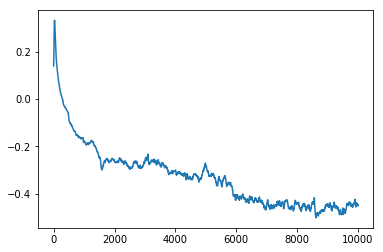
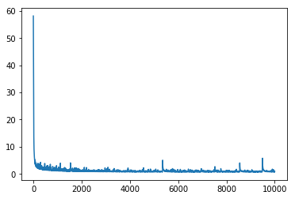
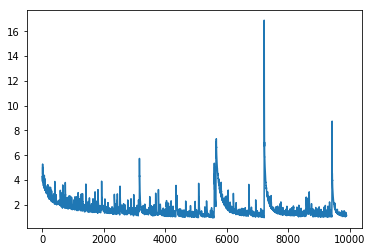

In this page we simulate data from a causal model in observational setting and examine the effect of omitted variables which stochastically predict the treatment assignment.

First import the necessary libraries:


```python
import numpy as np 
import pandas as pd 
import copy
import mlp

from sklearn.linear_model import LinearRegression, LogisticRegression
from glmnet import LogitNet, ElasticNet
import torch
import torch.nn as nn
import torch.nn.functional as F
from torch.autograd import Variable

import utils
from utils import simulate_x, nonlinear, simulate_params

from sklearn.preprocessing import StandardScaler

import matplotlib.pyplot as plt
```

Simulate 4 types of observed covariates:
X_c are a set of covariates that influence both the treatment and outcome, also called confouders.
X_iv are a set of covariates only influence treatment and not outcome, also called nstrumental variables.
X_y are a set of covariates only influence the outcome and not treatment.
X_n are a set of covariates influencing neither of treatment and outcome.

Accordingly, we define the number of covariates (dimension of columns) as p_c, p_iv, p_y, p_n

We fix the correlation between the covarites in each set to follow the same pattern with the base correlation rho. The correlation pattern is so that corr(X_j, X_k) = rho^(j-k). This is known as auto-regressive, AR(1).

We let the range of signals sizes be between r1 and r2.

We let the treatment be a binary treatment with probability of treated to be pr.


```python
n, p_c, p_iv, p_y, p_n = 2000, 10, 10, 10, 10
rho = .5
```


```python
X_c = simulate_x(n=n, p=p_c, rho=rho, mean=0., sd=1., corr="AR(1)")
X_iv = simulate_x(n=n, p=p_iv, rho=rho, mean=0., sd=1., corr="AR(1)")
X_y = simulate_x(n=n, p=p_y, rho=rho, mean=0., sd=1., corr="AR(1)")
X_n = simulate_x(n=n, p=p_n, rho=rho, mean=0., sd=1., corr="AR(1)")
```


```python
X_c.shape, X_iv.shape, X_y.shape, X_n.shape
```


    ((2000, 10), (2000, 10), (2000, 10), (2000, 10))


Let's agument some nonlinear functions of the columns in each covariate matrix:

f1(x1, x2) = exp(x1*x2/2)

f2(x1, x2) = x1/(1+exp(x2))

f3(x1, x2) = (x1*x2/10+2)^3

f4(x1, x2) = (x1+x2+3)^2

f5(x1, x2) = g(x1) * h(x2)

where

g(x) = -2 * I(x < -1) - I(-1 < x < 0) + I(0 < x < 2)+ 3 * I(x > 2)

h(x) = -5 * I(x < 0) - 2 * I(0 < x < 1) + 3 * I(x > 1)

and 

f6(x1, x2) = g(x1) * h(x2)

where 

g(x) = I(x > 0)

h(x) = I(x > 1)


We let "prob" proportion of covariates in each matrix to be replaced by randomly selected nonlinearities. These nonlinearities are bivariate. We randomly select two of the covariates each time and implement the nonlinearities.


```python
X_c_latent = nonlinear(X_c, prob=.10)# prob is the proportion of columns that are replaced by nonlinear functions.
X_iv_latent = nonlinear(X_iv, prob=.10)
X_y_latent = nonlinear(X_y, prob=.10)
```

Fix the effects of the confounders, instrumental variables and irrelevant variable (those that just predict outcome but not the treatment and those that predict neither of them.)


```python
r1 = .1
r2 = 2.
r = ["uniform", r1, r2]
```

Generate the treatment given the confounders and instrumental variables:


```python
param_iv = simulate_params(p1=p_iv, r=r)
param_c_A = simulate_params(p1=p_c, r=r)
xbeta_iv = np.dot(X_iv_latent, param_iv) + np.dot(X_c_latent, param_c_A)
pr = 1./(1. + np.exp(-xbeta_iv))
A = np.random.binomial(1, pr, size=(n, 1))
```

Generate the outcome given the confounders and its own predictors:


```python
param_y = simulate_params(p1=p_y + p_c, r=r)
TE = -1
beta0 = 2
xbeta_y = beta0 + TE*A + np.dot(np.hstack((X_y_latent, X_c_latent)), param_y).reshape(-1, 1)

y = xbeta_y + np.random.normal(size=(n, 1))
```

Let's stack all types of covariates in one giant matrix and standardize the inputs. Note that these are observed covariates, not the non-linear ones.


```python
index_c = np.arange(p_c)
index_iv = np.arange(p_c, p_c + p_iv)

x_ = np.concatenate([X_c, X_iv, X_y, X_n], axis=1)# Big data with all covarites (excluding th treatment)

sdtz = StandardScaler()
x = sdtz.fit_transform(x_) # Mean 0 and unit variance 
```


```python
np.hstack((Y, np.hstack((A, x)))).to_csv("./py_data2r.csv")
```


```python
%%time
from rpy2.robjects.packages import importr
import rpy2.robjects as ro
import rpy2.robjects.numpy2ri
rpy2.robjects.numpy2ri.activate()

nr,nc = x.shape
x_r = ro.r.matrix(x, nrow=nr, ncol=nc)
```

    CPU times: user 519 ms, sys: 695 ms, total: 1.21 s
    Wall time: 343 ms


```python
utils = importr("tmle")
ro.r('library("tmle")')

ro.r('A = c{}'.format(tuple(A.flatten())))

ro.r('W = c{}'.format(tuple(x_r)))
ro.r("W = matrix(W, nrow={}, ncol={})".format(nr, nc))

ro.r('y = c{}'.format(tuple(y.flatten())))
```


    array([ -7.49767596,   0.6259413 , -16.89997266, ...,  -4.13262718,
            -2.44109489,  -4.3818042 ])


```python
%%time
tmle_results = ro.r('results <- tmle(Y=y,A=A,W=W)')
```

    CPU times: user 5min 48s, sys: 403 ms, total: 5min 49s
    Wall time: 1min 24s


```python
ro.r('results$estimates')[1]
```


    <span>ListVector with 4 elements.</span>
    <table>
      <tbody>
      
      <tr>
      <th>
        psi
      </th>
      <td>
        
    <span>FloatVector with 1 elements.</span>
    <table>
      <tbody>
      <tr>
      
      <td>
        -0.154321
      </td>
      
      </tr>
      </tbody>
    </table>
    
      </td>
      </tr>
      
      <tr>
      <th>
        var.psi
      </th>
      <td>
        
    <span>FloatVector with 1 elements.</span>
    <table>
      <tbody>
      <tr>
      
      <td>
        0.016077
      </td>
      
      </tr>
      </tbody>
    </table>
    
      </td>
      </tr>
      
      <tr>
      <th>
        CI
      </th>
      <td>
        
    <span>FloatVector with 2 elements.</span>
    <table>
      <tbody>
      <tr>
      
      <td>
        -0.402843
      </td>
      
      <td>
        0.094201
      </td>
      
      </tr>
      </tbody>
    </table>
    
      </td>
      </tr>
      
      <tr>
      <th>
        pvalue
      </th>
      <td>
        
    <span>FloatVector with 1 elements.</span>
    <table>
      <tbody>
      <tr>
      
      <td>
        0.223576
      </td>
      
      </tr>
      </tbody>
    </table>
    
      </td>
      </tr>
      
      </tbody>
    </table>
    


```python
tmle_summary = ro.r('results')
```


```python
ro.r('W = dim(c{})'.format(tuple(x_r)))
```


```python

```


```python

```


```python
class NNLinear(torch.nn.Module):
    def __init__(self, p, hidden, skip_connection=True, activation="relu", batch_norm=True, **kwargs):
        super(NNLinear, self).__init__()
        
        if p != int(p):
            raise ValueError("p, the number of inputs should be integer.")
        
        if not isinstance(hidden, list):
            raise ValueError("hidden should be a list, containing hidden layer size(s).")
        
        self.skip_connection = skip_connection
        self.n_hidden_lyrs = len(hidden)
        self.batch_norm = batch_norm

        if activation is "relu":
            self.activation = F.relu
        elif activation is "tanh":
            self.activation = F.tanh

        if self.n_hidden_lyrs is 0:
            raise ValueError("Hidden layers cannot have zero length.")
        else:
            hidden = [p] + hidden

            if self.n_hidden_lyrs != 0:
                layers = nn.ModuleDict()
                bn = nn.ModuleDict()
                for i in range(self.n_hidden_lyrs):
                    layers[str(i)] = torch.nn.Linear(hidden[i], hidden[i + 1])
                    bn[str(i)] = torch.nn.BatchNorm1d(num_features=hidden[i + 1])
                self.layers = layers
                self.bn = bn

            if self.skip_connection:
                self.linear_out = torch.nn.Linear(hidden[self.n_hidden_lyrs] + p, 1)
            else:
                self.linear_out = torch.nn.Linear(hidden[self.n_hidden_lyrs], 1)
                
        self.kwargs = kwargs
        self.do_drop = False
        if "prob" in self.kwargs:
            prob = float(self.kwargs["prob"])
            if prob > 0.:
                self.do_drop = True
                self.drop = torch.nn.Dropout(p=prob)
            
        self.treatment = torch.nn.Linear(1, 1, bias=True)
        
    def forward(self, x, A):
        out = x

        for i in range(self.n_hidden_lyrs):
            out = self.layers[str(i)](out)
            out = self.activation(out)
            if self.batch_norm:
                out = self.bn[str(i)](out)
            
        if self.do_drop is True:
            out = self.drop(out)
            
        if self.skip_connection is True:
            out = torch.cat((out, x), 1)
        else:
            out = self.linear_out(out)
        
        if self.do_drop is True:
            out = self.drop(out)
            
        out = out + self.treatment(A)
        return(out)
    
```


```python
device = torch.device("cuda:0" if torch.cuda.is_available() else "cpu")
# device = torch.device("cpu")
n, p = x.shape
xx = x.copy()
yy = y.copy()
x_tensor = Variable(torch.from_numpy(xx).float(), requires_grad = False).to(device)
A_tensor = Variable(torch.from_numpy(A.reshape(-1, 1)).float(), requires_grad = False).to(device)
y_tensor = Variable(torch.from_numpy(yy.reshape(-1, 1)).float(), requires_grad = False).to(device)
```


```python
%%time
n, p = x.shape
hidden = [p]*3# numbre of hidden layres: 1

A_tensor.requires_grad_()
# inp.requires_grad_()

nnlinear_instance_1h = NNLinear(p, hidden, skip_connection=False, activation="relu", batch_norm=True, prob=0.).to(device)
# nnlinear_instance_1h.treatment.weight.data.fill_(0)
# nnlinear_instance_1h.treatment.bias.data.fill_(0)

print(device)
print(next(nnlinear_instance_1h.parameters()).is_cuda)

loss = torch.nn.MSELoss(size_average=True)
optimizer  = torch.optim.Adam(nnlinear_instance_1h.parameters(),  lr = 0.01)
optimizer.zero_grad()
# optimizer  = torch.optim.ASGD(nnlinear_instance_1h.parameters(),  lr = 0.01)
# optimizer  = torch.optim.SGD(nnlinear_instance_1h.parameters(), momentum=.9, lr = 0.01)

# training
nnlinear_instance_1h.train()
reg_lambda = .01

old_loss = 0.
j = 0
list_loss = []
list_TE = []

steps = 0
num_times_steady = 0
old_step = 0

old_TE_100 = 0

for epoch in range(10000):
    l1_reg = 0. 
    for name, param in nnlinear_instance_1h.named_parameters():
        if "treatment.weight" not in name and "treatment.bias" not in name:
            l1_reg += torch.sum(torch.abs(param))

#     x_jacob = jacob_maker(model=nnlinear_instance_1h, tensor_inputs=[x_tensor[:10, :], A_tensor[:10, :]], jacob_index_inputs=[0])
#     l1_reg = torch.abs(sum([js for js in x_jacob])).mean()
    
    
    y_pred = nnlinear_instance_1h(x_tensor, A_tensor)

    l = loss(y_pred, y_tensor) + reg_lambda * l1_reg

    optimizer.zero_grad()
    l.backward()
    optimizer.step()
    list_loss += [l]
 
    for name, param in nnlinear_instance_1h.named_parameters():
        if "treatment.weight" in name:
            list_TE += [param.data[0][0].to("cpu").numpy()]
    
    steps += 1
    n_aggr = 50
    if epoch % n_aggr == 0:
        avg_recent_TEs = np.median(np.array(list_TE[-n_aggr:]))#1. * sum(list_TE[-n_aggr:])/n_aggr
        print(avg_recent_TEs)
        if np.abs(old_TE_100 - avg_recent_TEs) < .001:
            if np.abs(steps - old_step) > 2:
                num_times_steady = 0
                
            num_times_steady += 1
            old_step = steps
            print("bingo!")
            if num_times_steady > 2:
                break
        old_TE_100 = avg_recent_TEs
        

print("final TE as average of last {} TE estimate: ".format(str(n_aggr)), avg_recent_TEs)
print("Number of iterations: ", steps)
print("median of estimates in last 100 iterations: ",np.median(np.array(list_TE[-100:])))
print("Estimate of TE for minimal loss: ", float(list_TE[np.argmin(np.array(list_loss))]))

# k = 10
# numpy_loss = np.array(list_loss)
# numpy_TE = np.array(list_TE)
# k_smallest_loss_inx = np.argpartition(numpy_loss, k)

# print("Estimate of TE by averaging k smallest losses: ", float(np.median(numpy_TE[k_smallest_loss_inx[:k]])))

# # for name, param in nnlinear_instance_1h.named_parameters():
# #     if "treatment.weight" in name:
# #         print("treatment effect: " + str(param.data[0][0].to("cpu").numpy()))
```

    cuda:0
    True
    0.13941467
    0.29445618


    /home/mr/.local/lib/python3.6/site-packages/torch/nn/_reduction.py:49: UserWarning: size_average and reduce args will be deprecated, please use reduction='mean' instead.
      warnings.warn(warning.format(ret))


    0.18746087
    0.112009466
    0.06068548
    0.026347306
    0.0035959934
    -0.024366872
    -0.03525747
    -0.04526251
    -0.05625871
    -0.099412695
    -0.11074516
    -0.12258196
    -0.13497822
    -0.149389
    -0.15222263
    -0.16102585
    -0.16347548
    -0.1651099
    -0.17884097
    -0.18100896
    -0.19083844
    -0.18860918
    -0.18630755
    -0.17786852
    -0.18191868
    -0.19578484
    -0.20112541
    -0.22116956
    -0.23740163
    -0.24897924
    -0.29626986
    -0.2811309
    -0.26530808
    -0.2525527
    -0.25768828
    -0.2648453
    -0.26006782
    -0.25323147
    -0.25678653
    -0.2663832
    -0.26594839
    bingo!
    -0.26341486
    -0.25229818
    -0.2634802
    -0.2675552
    -0.26710463
    bingo!
    -0.26911217
    -0.28028378
    -0.28895897
    -0.2910347
    -0.28915778
    -0.26957926
    -0.26579118
    -0.2681575
    -0.28615123
    -0.28794986
    -0.28747398
    bingo!
    -0.2855228
    -0.26849568
    -0.24927512
    -0.24645932
    -0.27131784
    -0.26918334
    -0.2598593
    -0.26249462
    -0.265939
    -0.27446496
    -0.263982
    -0.27213326
    -0.28171688
    -0.2712643
    -0.28055334
    -0.28683463
    -0.29222524
    -0.3158291
    -0.3112853
    -0.3084221
    -0.30769885
    bingo!
    -0.3042677
    -0.31265384
    -0.31430086
    -0.30972177
    -0.31574243
    -0.31881094
    -0.3223905
    -0.32035452
    -0.3218243
    -0.33431458
    -0.33392042
    bingo!
    -0.33878785
    -0.32852542
    -0.3160069
    -0.32126206
    -0.32756034
    -0.34251702
    -0.33589286
    -0.32039246
    -0.3008263
    -0.27953404
    -0.29223335
    -0.3072978
    -0.32414824
    -0.31934643
    -0.31798196
    -0.32801065
    -0.3487921
    -0.3624264
    -0.3325411
    -0.34436357
    -0.3618889
    -0.33730882
    -0.32740137
    -0.36388487
    -0.35670543
    -0.35711318
    bingo!
    -0.3643205
    -0.38081184
    -0.40737253
    -0.42004704
    -0.40651876
    -0.42084178
    -0.41418004
    -0.41651648
    -0.40864754
    -0.42029417
    -0.4316442
    -0.42581177
    -0.4288323
    -0.42065307
    -0.42549515
    -0.43380326
    -0.42126346
    -0.43056214
    -0.429574
    bingo!
    -0.42728716
    -0.43274903
    -0.44137728
    -0.45871836
    -0.46009132
    -0.43344665
    -0.4530737
    -0.45067298
    -0.45708224
    -0.45454222
    -0.4488881
    -0.44857824
    bingo!
    -0.44025546
    -0.43495184
    -0.44894373
    -0.43709517
    -0.45043957
    -0.43049496
    -0.43150008
    -0.45899972
    -0.4626024
    -0.4545281
    -0.4648919
    -0.43639982
    -0.44028562
    -0.43780458
    -0.45752788
    -0.46627498
    -0.45236593
    -0.4422594
    -0.46270606
    -0.45406502
    -0.45391637
    bingo!
    -0.46655732
    -0.44687682
    -0.44089133
    -0.4449007
    -0.49276763
    -0.4864769
    -0.4791413
    -0.4746842
    -0.46930724
    -0.47156638
    -0.45453858
    -0.4459644
    -0.45238656
    -0.4470805
    -0.46676043
    -0.4548923
    -0.44202465
    -0.45585385
    -0.4587624
    -0.4772079
    -0.4712276
    -0.48551378
    -0.46952778
    -0.47627878
    -0.44694465
    -0.4455772
    -0.43942654
    -0.44942194
    -0.45097256
    -0.44101083
    -0.4467741
    final TE as average of last 50 TE estimate:  -0.4467741
    Number of iterations:  10000
    median of estimates in last 100 iterations:  -0.4453929
    Estimate of TE for minimal loss:  -0.438199520111084
    CPU times: user 34 s, sys: 3.59 s, total: 37.6 s
    Wall time: 37.9 s


```python
plt.plot(np.array(list_TE))
plt.show()
```





```python
plt.plot(np.array(list_loss))
plt.show()
```





```python

```


```python
class BNN(torch.nn.Module):
    def __init__(self, p, hidden, skip_connection=True, activation="relu", batch_norm=False, **kwargs):
        super(BNN, self).__init__()
        
        if p != int(p):
            raise ValueError("p, the number of inputs should be integer.")
        
        if not isinstance(hidden, list):
            raise ValueError("hidden should be a list, containing hidden layer size(s).")
        
        self.skip_connection = skip_connection
        self.n_hidden_lyrs = len(hidden)
        self.batch_norm = batch_norm

        if activation is "relu":
            self.activation = F.relu
        elif activation is "tanh":
            self.activation = F.tanh

        if self.n_hidden_lyrs is 0:
            raise ValueError("Hidden layers cannot have zero length.")
        else:
            hidden = [p] + hidden

            if self.n_hidden_lyrs != 0:
                layers = nn.ModuleDict()
                bn = nn.ModuleDict()
                for i in range(self.n_hidden_lyrs):
                    layers[str(i)] = torch.nn.Linear(hidden[i], hidden[i + 1])
                    bn[str(i)] = torch.nn.BatchNorm1d(num_features=hidden[i + 1])
                self.layers = layers
                self.bn = bn

            if self.skip_connection:
                self.linear_out_y = torch.nn.Linear(hidden[self.n_hidden_lyrs] + p, 1)
                self.linear_out_A = torch.nn.Linear(hidden[self.n_hidden_lyrs] + p, 1)
            else:
                self.linear_out_y = torch.nn.Linear(hidden[self.n_hidden_lyrs], 1)
                self.linear_out_A = torch.nn.Linear(hidden[self.n_hidden_lyrs], 1)
                
        self.kwargs = kwargs
        self.do_drop = False
        if "prob" in self.kwargs:
            prob = float(self.kwargs["prob"])
            if prob > 0.:
                self.do_drop = True
                self.drop = torch.nn.Dropout(p=prob)
        
        self.treatment = torch.nn.Linear(1, 1, bias=True)
        
    def forward(self, x, A):
        out = x

        for i in range(self.n_hidden_lyrs):
            out = self.layers[str(i)](out)
            out = self.activation(out)
            if self.batch_norm:
                out = self.bn[str(i)](out)
            
        if self.do_drop is True:
            out = self.drop(out)
            
        if self.skip_connection is True:
            out = torch.cat((out, x), 1)
        
        out_y = self.linear_out_y(out)
        out_A = F.sigmoid(self.linear_out_A(out))
        
        if self.do_drop is True:
            out_y = self.drop(out_y)
            out_A = self.drop(out_A)
        
        out_y = out_y + self.treatment(A)
        return(out_y, out_A)
    
```


```python
%%time
n, p = x.shape
hidden = [p]*6# numbre of hidden layres: 1


bnn_instance_1h = BNN(p, hidden, skip_connection=False, activation="relu", batch_norm=True, prob=0.).to(device)


loss_y = torch.nn.MSELoss(size_average=True)
loss_A = torch.nn.BCELoss()
optimizer  = torch.optim.Adam(bnn_instance_1h.parameters(),  lr = 0.01)

# training
bnn_instance_1h.train()
reg_lambda = .01

old_loss = 0.
j = 0
list_loss_bnn = []
list_TE_bnn = []

steps = 0
num_times_steady = 0
consecutive_steps = 0

old_TE_100 = 0

for epoch in range(10000):
    l1_reg = 0. 
    for name, param in bnn_instance_1h.named_parameters():
        if "treatment.weight" not in name and "treatment.bias" not in name:
            l1_reg += torch.sum(torch.abs(param))

    y_pred, A_pred = bnn_instance_1h(x_tensor, A_tensor)
    
    l = loss_y(y_pred, y_tensor) + loss_A(A_pred, A_tensor) + reg_lambda * l1_reg
    
    optimizer.zero_grad()
    l.backward()
    optimizer.step()
    
    list_loss_bnn += [l]
 
    for name, param in bnn_instance_1h.named_parameters():
        if "treatment.weight" in name:
            list_TE_bnn += [param.data[0][0].to("cpu").numpy()]
    
    steps += 1
    n_aggr = 100
    if epoch % n_aggr == 0:
        avg_recent_TEs = np.median(np.array(list_TE_bnn[-n_aggr:]))#1. * sum(list_TE_bnn[-n_aggr:])/n_aggr
        print(avg_recent_TEs)
        if np.abs(old_TE_100 - avg_recent_TEs) < .001:
            if np.abs(steps - consecutive_steps) > 1:
                num_times_steady = 0
            num_times_steady += 1
            consecutive_steps = steps
            print("bingo!")
            if num_times_steady > 2:
                break
        old_TE_100 = avg_recent_TEs
        

print("final TE as average of last 100 TE estimate: ", avg_recent_TEs)
print("Number of iterations: ", steps)
print("median of estimates in last 100 iterations: ",np.median(np.array(list_TE_bnn[-1000:])))
print("Estimate of TE for minimal loss: ", float(list_TE_bnn[np.argmin(np.array(list_loss_bnn))]))

k = 50
numpy_loss = np.array(list_loss_bnn)
numpy_TE = np.array(list_TE_bnn)
k_smallest_loss_inx = np.argpartition(numpy_loss, k)

print("Estimate of TE by averaging k smallest losses: ", float(np.median(numpy_TE[k_smallest_loss_inx[:k]])))

# for name, param in bnn_instance_1h.named_parameters():
#     if "treatment.weight" in name:
#         print("treatment effect: " + str(param.data[0][0].to("cpu").numpy()))

```

    /home/mr/.local/lib/python3.6/site-packages/torch/nn/_reduction.py:49: UserWarning: size_average and reduce args will be deprecated, please use reduction='mean' instead.
      warnings.warn(warning.format(ret))
    /home/mr/.local/lib/python3.6/site-packages/torch/nn/functional.py:1332: UserWarning: nn.functional.sigmoid is deprecated. Use torch.sigmoid instead.
      warnings.warn("nn.functional.sigmoid is deprecated. Use torch.sigmoid instead.")


    -0.32357597
    -0.1464124
    -0.15358144
    -0.17049229
    -0.19006461
    -0.18240976
    -0.17652708
    -0.18394107
    -0.18552624
    -0.19997722
    -0.22379641
    -0.23687597
    -0.2717421
    -0.3095765
    -0.35482052
    -0.36798516
    -0.38755077
    -0.42144662
    -0.44913688
    -0.45995414
    -0.49987173
    -0.5024061
    -0.5117333
    -0.5199035
    -0.532441
    -0.536471
    -0.53415775
    -0.5350486
    bingo!
    -0.54875565
    -0.5588362
    -0.5730556
    -0.5824733
    -0.58217525
    bingo!
    -0.57814145
    -0.5489106
    -0.5613375
    -0.5489396
    -0.5211669
    -0.5425513
    -0.54243815
    bingo!
    -0.555527
    -0.5726439
    -0.580618
    -0.6005479
    -0.58810055
    -0.5951791
    -0.5796819
    -0.58084
    -0.59472513
    -0.58394396
    -0.56376433
    -0.5709644
    -0.5719429
    bingo!
    -0.5644983
    -0.53445566
    -0.5168946
    -0.5426165
    -0.5328591
    -0.50513947
    -0.60904145
    -0.64036304
    -0.6478798
    -0.6503948
    -0.65028733
    bingo!
    -0.6393037
    -0.6117965
    -0.62168896
    -0.6361871
    -0.6330801
    -0.61394095
    -0.6043271
    -0.5984275
    -0.5947716
    -0.6090431
    -0.5438161
    -0.64402187
    -0.7200111
    -0.7539425
    -0.7512442
    -0.71101344
    -0.67433417
    -0.6611283
    -0.64988685
    -0.62204814
    -0.61530685
    -0.6213709
    -0.6315353
    -0.5922152
    -0.5736103
    -0.5487503
    -0.53593975
    -0.53400517
    -0.53190136
    -0.5416846
    -0.5536028
    -0.5571266
    -0.5449517
    -0.5597112
    -0.5465221
    -0.56876457
    final TE as average of last 100 TE estimate:  -0.56876457
    Number of iterations:  10000
    median of estimates in last 100 iterations:  -0.5498667
    Estimate of TE for minimal loss:  -0.531083345413208
    Estimate of TE by averaging k smallest losses:  -0.5405887365341187
    CPU times: user 1min 3s, sys: 7.48 s, total: 1min 11s
    Wall time: 1min 11s


```python
plt.plot(np.array(list_TE_bnn[100:]))
plt.show()
```


```python
plt.plot(np.array(list_loss_bnn[100:]))
plt.show()
```




